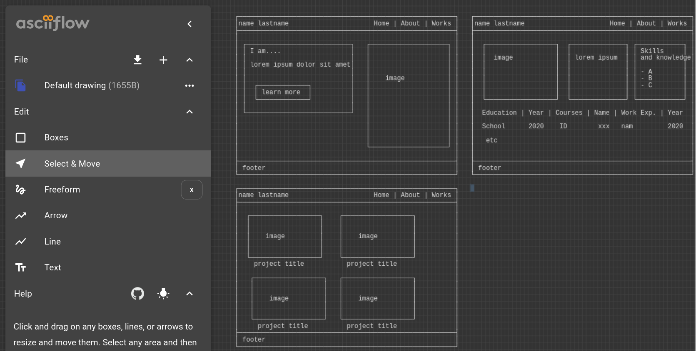
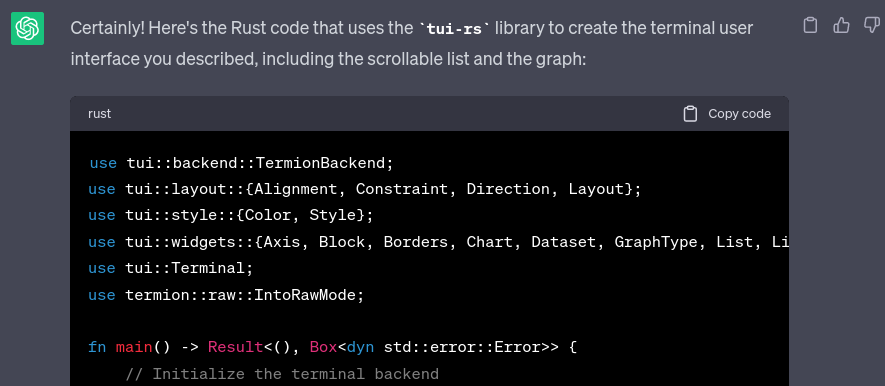
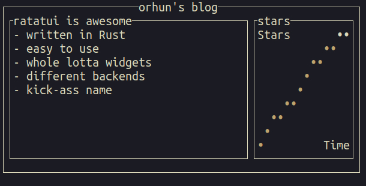
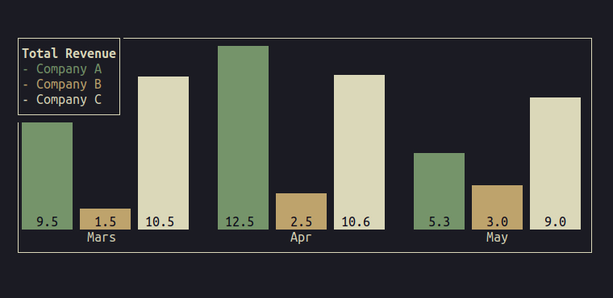

+++
title = "Generating terminal user interfaces with Ratatui + ChatGPT"
date = "2023-07-17"
authors = ["Orhun Parmaksız (https://orhun.dev/)"]
+++

Reposted from <https://blog.orhun.dev/ratatui-0-22-0/>

"[**Ratatui**](https://github.com/ratatui-org/ratatui)" is a Rust library for building rich terminal
user interfaces. In this post, I'm sharing what's new in the latest version and also a fun way to
easily create terminal user interfaces in a jiffy.

<!-- more -->

See my [previous blog post](https://blog.orhun.dev/ratatui-0-21-0/) about `ratatui` for
retrospectives and the status of the project.

Today marks the new release of `ratatui` and we are very excited to share the new things we have
been working on in the last month. But before anything, a couple of news about the project:

- We had a meeting on 2023-07-16, you can read the meeting notes
  [here](https://github.com/ratatui-org/ratatui/discussions/316).
- We will have scheduled meetings soon for discussing the status of the project more often. (Still
  deciding the time & day for that).
- Join the [Discord server](https://discord.gg/pMCEU9hNEj) for keeping up-to-date with `ratatui`
  news and contributing to the project!

We appreciate everyone who contribute to the project and most importantly [Florian
Dehau](https://github.com/fdehau) for creating tui-rs in the first place! 💖

Today, I decided to do something different and share a fun thing that has been on my mind for a
while before going into what's new in `ratatui`.

So, without further ado, let's dive into it! 🐁

---

## Generating terminal user interfaces

I have a new open source project coming up in the next months and I am happy to say that I have been
using `ratatui` extensively to build it from the ground. Although it is fun to write TUI code, I
sometimes think if it would be possible to find an easier/faster way to avoid boilerplate code and
speed up the development. We are still working on improving the widget/stylization API of `ratatui`
to avoid code repetition but still, I sometimes find myself rewriting the same code over and over
again.

One day, I had a flashback to a moment from months back where I needed to design a very basic HTML
page but I was too lazy to do it and used [ChatGPT](https://en.wikipedia.org/wiki/ChatGPT) for it.
Well, what if I generate the TUI code as well and save myself from the burden of imagining the
widget positions in my mind and trying to _code out_ abstract things. That would be nice, right?

**Q**: Well, ChatGPT does not support image processing for now. So why waste your time writing
prompts for your design instead of writing the actual code instead?

**A**: Who said I am going to write prompts?

**Q**: Huh?

That's right. While I was using ChatGPT to generate that simple HTML page, I came up with a
text-based but also visual solution. Ladies and gentlemen, I present to you:

> **ASCIIFlow**: a client-side only web based application for drawing ASCII diagrams.
>
> GitHub: [https://github.com/lewish/asciiflow](https://github.com/lewish/asciiflow)



<center>

[https://asciiflow.com](https://asciiflow.com)

</center>

So you can simply draw boxes, lines, arrows, texts, and whatever you imagine on a canvas and export
it (or copy it to the clipboard) easily.

In case it isn't clear, our plan is to:

- Design the interface on ASCIIFlow.
- Give the ASCII design (text) to ChatGPT.
- Generate Rust (`ratatui`) code.
- Profit.

Let's try it!

> **Prompt**: Write the Rust code for using `tui-rs` library for building the following terminal
> user interface:
>
> ```go
> ┌────────────────orhun's blog────────────────────┐
> │                                                │
> │ ┌─ratatui is awesome──────────┐ ┌─stars──────┐ │
> │ │ - written in Rust           │ │            │ │
> │ │                             │ │          │ │ │
> │ │ - easy to use               │ │         ┌┘ │ │
> │ │                             │ │         │  │ │
> │ │ - whole lotta widgets       │ │      ┌──┘  │ │
> │ │                             │ │      │     │ │
> │ │ - different backends        │ │      │     │ │
> │ │                             │ │      │     │ │
> │ │ - kick-ass name             │ │ ┌────┘     │ │
> │ │                             │ │ │          │ │
> │ │ (this is a scrollable list) │ │            │ │
> │ └─────────────────────────────┘ └────────────┘ │
> │                                                │
> └────────────────────────────────────────────────┘
> ```

Unfortunately, ChatGPT doesn't have the knowledge of `ratatui` yet and it cakes its pants when you
want to use it so we are using `tui-rs` in our prompt. Also, it suggests using `tui-rs` `0.16.0`
which shows how much it is left behind.

But anyways, it can generate some _usable_ Rust code for us.



If we remove the unrelated parts such as terminal/backend initialization and event handling, we are
left with:

<details>
<summary><b>Click to expand</b></summary>

```rs
let chunks = Layout::default()
        .direction(Direction::Vertical)
        .constraints([Constraint::Length(3), Constraint::Min(3), Constraint::Length(1)].as_ref())
        .split(terminal.size()?);

let header = Block::default()
    .borders(Borders::ALL)
    .title("orhun's blog")
    .title_style(Style::default().fg(Color::Cyan));

let paragraph = Paragraph::new("ratatui is awesome")
    .block(Block::default().title("".as_ref()).borders(Borders::ALL));

let stars = Paragraph::new("stars")
    .block(Block::default().title("".as_ref()).borders(Borders::ALL));

let widgets = vec![
    ListItem::new("- written in Rust"),
    ListItem::new("- easy to use"),
    ListItem::new("- whole lotta widgets"),
    ListItem::new("- different backends"),
    ListItem::new("- kick-ass name"),
];

let list = List::new(widgets)
    .block(Block::default().title("".as_ref()).borders(Borders::ALL))
    .highlight_style(Style::default().fg(Color::LightGreen));

let dataset = Dataset::default()
    .name("Stars")
    .marker(tui::symbols::Marker::Dot)
    .graph_type(GraphType::Line)
    .style(Style::default().fg(Color::Yellow))
    .data(&[
        (0.0, 0.0),
        (1.0, 100.0),
        (2.0, 200.0),
        (3.0, 300.0),
        (4.0, 400.0),
        (5.0, 500.0),
        (6.0, 600.0),
    ]);

let chart = Chart::new(vec![dataset])
    .block(Block::default().title("".as_ref()).borders(Borders::ALL))
    .x_axis(
        tui::widgets::Axis::default()
            .title("Time")
            .style(Style::default().fg(Color::White)),
    )
    .y_axis(
        tui::widgets::Axis::default()
            .title("Stars")
            .style(Style::default().fg(Color::White)),
    );

terminal.draw(|mut f| {
    f.render_widget(header, chunks[0]);
    f.render_widget(paragraph, chunks[1]);
    f.render_widget(stars, chunks[1]);
    f.render_stateful_widget(list, chunks[1], &mut Default::default());
    f.render_widget(chart, chunks[2]);
})?;
```

</details>

Which is clearly wrong but can be a good stepping stone for what we actually want to build.

Here is the final layout code with some edits:

<details>
<summary><b>Click to expand</b></summary>

```rs
// Render the header first.
let header = Block::default()
    .borders(Borders::ALL)
    .title(Title::from("orhun's blog").alignment(Alignment::Center))
    .title_style(Style::default().fg(Color::Cyan));
f.render_widget(header, terminal.size()?);

// Split the layout.
let chunks = Layout::default()
    .direction(Direction::Horizontal)
    .margin(1)
    .constraints([Constraint::Percentage(70), Constraint::Percentage(30)].as_ref())
    .split(terminal.size()?);

// Prepare the list.
let widgets = vec![
    ListItem::new("- written in Rust"),
    ListItem::new("- easy to use"),
    ListItem::new("- whole lotta widgets"),
    ListItem::new("- different backends"),
    ListItem::new("- kick-ass name"),
];

let list = List::new(widgets)
    .block(
        Block::default()
            .title("ratatui is awesome".as_ref())
            .borders(Borders::ALL),
    )
    .highlight_style(Style::default().fg(Color::LightGreen));

// Prepare the chart.
let dataset = Dataset::default()
    .name("Stars")
    .marker(Marker::Dot)
    .graph_type(GraphType::Line)
    .style(Style::default().fg(Color::Yellow))
    .data(&[
        (0.0, 0.0),
        (1.0, 100.0),
        (2.0, 200.0),
        (3.0, 300.0),
        (4.0, 400.0),
        (5.0, 500.0),
        (6.0, 600.0),
    ]);

let chart = Chart::new(vec![dataset])
    .block(
        Block::default()
            .title("stars".as_ref())
            .borders(Borders::ALL),
    )
    .x_axis(
        Axis::default()
            .title("Time")
            .style(Style::default().fg(Color::White))
            .bounds([0.0, 6.0]),
    )
    .y_axis(
        Axis::default()
            .title("Stars")
            .style(Style::default().fg(Color::White))
            .bounds([0.0, 600.0]),
    );

// Render.
terminal.draw(|mut f| {
    f.render_stateful_widget(list, chunks[0], &mut Default::default());
    f.render_widget(chart, chunks[1]);
})?;
```

</details>

And here we have it:



## **What's new?**

Now that we have seen what we can do using `ratatui`, it is time to get into the details of the
latest release!

**Full changelog**: [https://github.com/ratatui-org/ratatui/releases/tag/v0.22.0](https://github.com/ratatui-org/ratatui/releases/tag/v0.22.0)

---

### Prelude

We now have a `prelude` module! This allows users of the library to easily use `ratatui` without a
huge amount of imports.

```rs
use ratatui::prelude::*;
```

Aside from the main types that are used in the library, this `prelude` also re-exports several
modules to make it easy to qualify types that would otherwise collide. For example:

```rs
use ratatui::{prelude::*, widgets::*};

#[derive(Debug, Default, PartialEq, Eq)]
struct Line;

assert_eq!(Line::default(), Line);
assert_eq!(text::Line::default(), ratatui::text::Line::from(vec![]));
```

---

### New widget: Scrollbar

A scrollbar widget has been added which can be used with any `Rect`. It can also be customized with
different styles and symbols.

Here are the components of a `Scrollbar`:

```sh
<--▮------->
^  ^   ^   ^
│  │   │   └ end
│  │   └──── track
│  └──────── thumb
└─────────── begin
```

To use it, render it as a stateful widget along with `ScrollbarState`:

```rs
frame.render_stateful_widget(
    Scrollbar::default()
        .orientation(ScrollbarOrientation::VerticalRight)
        .begin_symbol(Some("↑"))
        .end_symbol(Some("↓")),
    rect,
    &mut scrollbar_state,
);
```

Will result in:

```sh
┌scrollbar──────────────────↑
│This is a longer line      ║
│Veeeeeeeeeeeeeeeery    looo█
│This is a line             ║
└───────────────────────────↓
```

---

### Block: support multiple titles

`Block` widget now supports having more than one title via `Title` widget.

Each title will be rendered with a single space separating titles that are in the same position or
alignment. When both centered and non-centered titles are rendered, the centered space is calculated
based on the full width of the block, rather than the leftover width.

You can provide various types as the title, including strings, string slices, borrowed strings
(`Cow<str>`), spans, or vectors of spans (`Vec<Span>`).

It can be used as follows:

```rs
Block::default()
    .borders(Borders::ALL)
    .title("Title") // By default in the top right corner
    .title(Title::from("Left").alignment(Alignment::Left))
    .title(Title::from("Center").alignment(Alignment::Center))
    .title(Title::from("Bottom").position(Position::Bottom))
    .title(
        Title::from("Bottom center")
            .alignment(Alignment::Center)
            .position(Position::Bottom),
    );
```

Results in:

```sh
┌Title─Left──Center─────────────┐
│                               │
│                               │
│                               │
└Bottom───Bottom center─────────┘
```

---

### Barchart: support groups

`Barchart` has been improved to support adding multiple bars from different data sets. This can be
done by using the newly added `Bar` and `BarGroup` objects.

This makes it possible to render fancy stuff like this:



See the [barchart example](https://github.com/ratatui-org/ratatui/blob/main/examples/barchart.rs)
for more information and implementation details.

---

### Stylization shorthands

It is possible to use style shorthands for `str`, `Span`, and `Paragraph`.

A crazy example would be:

```rs
"hello"
    .on_black()
    .black()
    .bold()
    .underline()
    .dimmed()
    .slow_blink()
    .crossed_out()
    .reversed()
```

This especially helps with concise styling:

```rs
assert_eq!(
  "hello".red().on_blue().bold(),
  Span::styled("hello", Style::default().fg(Color::Red).bg(Color::Blue).add_modifier(Modifier::BOLD))
)
```

---

### Stylize everything

All widgets can be styled now (i.e. `set_style`)

`Styled` trait is implemented for all the remaining widgets, including:

- `Barchart`
- `Chart` (including `Axis` and `Dataset`)
- `Gauge` and `LineGauge`
- `List` and `ListItem`
- `Sparkline`
- `Table`, `Row`, and `Cell`
- `Tabs`
- `Style`

---

### Constant styles

`Style`s can be constructed in a `const` context as follows:

```rs
const DEFAULT_MODIFIER: Modifier = Modifier::BOLD.union(Modifier::ITALIC);
const EMPTY: Modifier = Modifier::empty();

const DEFAULT_STYLE: Style = Style::with(DEFAULT_MODIFIER, EMPTY)
    .fg(Color::Red)
    .bg(Color::Black);
```

---

### More colors formats

It is now possible to parse hyphenated color names like `light-red` via `Color::from_str`.

Additionally, all colors from the [ANSI color
table](https://en.wikipedia.org/wiki/ANSI_escape_code#Colors) are supported (though some names are
not exactly the same).

- `gray` is sometimes called `white` - this is not supported as we use `white` for bright white
- `gray` is sometimes called `silver` - this is supported
- `darkgray` is sometimes called `light black` or `bright black` (both are supported)
- `white` is sometimes called `light white` or `bright white` (both are supported)
- we support `bright` and `light` prefixes for all colors
- we support `-` and `_` and `` as separators for all colors
- we support both `gray` and `grey` spellings

For example:

```rs
use ratatui::style::Color;
use std::str::FromStr;

assert_eq!(Color::from_str("red"), Ok(Color::Red));
assert_eq!("red".parse(), Ok(Color::Red));
assert_eq!("lightred".parse(), Ok(Color::LightRed));
assert_eq!("light red".parse(), Ok(Color::LightRed));
assert_eq!("light-red".parse(), Ok(Color::LightRed));
assert_eq!("light_red".parse(), Ok(Color::LightRed));
assert_eq!("lightRed".parse(), Ok(Color::LightRed));
assert_eq!("bright red".parse(), Ok(Color::LightRed));
assert_eq!("bright-red".parse(), Ok(Color::LightRed));
assert_eq!("silver".parse(), Ok(Color::Gray));
assert_eq!("dark-grey".parse(), Ok(Color::DarkGray));
assert_eq!("dark gray".parse(), Ok(Color::DarkGray));
assert_eq!("light-black".parse(), Ok(Color::DarkGray));
assert_eq!("white".parse(), Ok(Color::White));
assert_eq!("bright white".parse(), Ok(Color::White));
```

---

### Integrations

Following tools are now integrated into the repository:

- [`cargo-husky`](https://github.com/rhysd/cargo-husky): git pre-push hooks
- [`bacon`](https://github.com/Canop/bacon): background code checks / coverage
- [`commitizen`](https://github.com/commitizen/cz-cli): conventional commits
- [`cargo-deny`](https://github.com/EmbarkStudios/cargo-deny): linting dependencies
- [`typos`](https://github.com/crate-ci/typos): spell checker

---

### Other

- Benchmarks added for the `Paragraph` widget
- Added underline colors support for `crossterm` backend
- Mark some of the low-level functions of `Block`, `Layout` and `Rect` as `const`
- The project license has been updated to acknowledge `ratatui` developers

---

## Endnote

Feel free to join the [Discord server](https://discord.gg/pMCEU9hNEj) for chatting/getting help
about `ratatui`. If you are interested in contributing, check out our [contribution
guidelines](https://github.com/ratatui-org/ratatui/blob/main/CONTRIBUTING.md) and [open
issues](https://github.com/ratatui-org/ratatui/issues) for getting started!

Also, check out [these cool apps](https://github.com/ratatui-org/ratatui/wiki/Apps-using-Ratatui)
using `ratatui`!

Lastly, shout out to these awesome people for their first contributions to the project:

- [@Nydragon](https://github.com/Nydragon)
- [@snpefk](https://github.com/snpefk)
- [@Philipp-M](https://github.com/Philipp-M)
- [@mrbcmorris](https://github.com/mrbcmorris)
- [@endepointe](https://github.com/endepointe)
- [@kdheepak](https://github.com/kdheepak)
- [@samyosm](https://github.com/samyosm)
- [@SLASHLogin](https://github.com/SLASHLogin)
- [@karthago1](https://github.com/karthago1)
- [@BoolPurist](https://github.com/BoolPurist)
- [@Nogesma](https://github.com/Nogesma)
- [@lthoerner](https://github.com/lthoerner)

Cheers!

🐭
