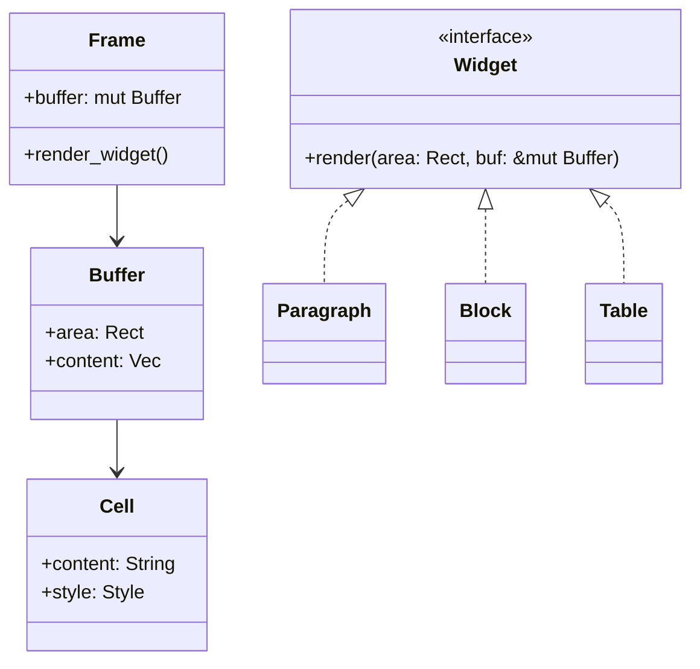

# How does Ratatui work?

You may have read in previous sections that Ratatui is a immediate mode rendering library. But what
does that really mean? And how is it implemented? In this section, we are going to discuss what it
means "to be a `Widget`" and what happens behind the scenes in Ratatui.

In Ratatui, the primary mechanism for making something that is renderable is through the `Widget`
trait.

```rust
pub trait Widget {
    /// Draws the current state of the widget in the given buffer. That is the only method required
    /// to implement a custom widget.
    fn render(self, area: Rect, buf: &mut Buffer);
}
```

Any struct (inside Ratatui or third party crates) can provide an implementation of the `Widget`
trait for said struct, making an instance of that struct renderable to the terminal.

For example, the `Paragraph` struct is a widget provided by Ratatui. Here's how you may use the
`Paragraph` widget:

```rust
fn main() {
    let mut terminal = ratatui::terminal::Terminal::new(ratatui::backend::CrosstermBackend::new(std::io::stderr()))?;

    terminal.draw(|f| {
        f.render_widget(Paragraph::new("Hello World!"), f.size());
    })?;
}
```

In order to use Ratatui, users are expected to create an instance of the `Terminal` struct and call
the `draw` method by passing in a function. This function takes one argument of type [`Frame`]. For
example, the following code is exactly equivalent to the code above:

```rust
fn main() {
    let mut terminal = ratatui::terminal::Terminal::new(ratatui::backend::CrosstermBackend::new(std::io::stderr()))?;

    terminal.draw(ui)?;
}

fn ui(frame: &mut Frame) {
    frame.render_widget(
        Paragraph::new("Hello World!"),
        frame.size(),
    );
}
```

This `Frame` struct contains a method called `render_widget` which takes any object that implements
the `Widget` trait. This `render_widget` method calls the `Widget::render` method on the type-erased
`Widget` struct.

```rust
    pub fn render_widget<W>(&mut self, widget: W, area: Rect)
    where
        W: Widget,
    {
        widget.render(area, self.buffer);
    }
```

As mentioned above, implementing the `Widget` trait is the primary way to make a struct renderable.
As an example, here's the full implementation for the `Clear` widget:

```rust
pub struct Clear;

impl Widget for Clear {
    fn render(self, area: Rect, buf: &mut Buffer) {
        for x in area.left()..area.right() {
            for y in area.top()..area.bottom() {
                buf.get_mut(x, y).reset();
            }
        }
    }
}
```

There are 2 things that you should notice.

1. The `Widget` gets the current area as a `Rect`.
2. The `Widget` gets a mutable reference to a "`Buffer`".

The top level widget usually gets a reference to the entire size of the terminal as a `Rect`, i.e.
`f.size()`. However, nested widgets may get a smaller area. Any implementation of a `Widget` must
only draw "within the lines" of the `Rect` area.

You might think that a `Widget` renders directly to the terminal but that is not the case. Ratatui
uses something called a "double-buffer" rendering technique.

Every time `terminal.draw(|f| ...)` is called, a new [`Frame`] struct is constructed that contains a
mutable reference to an instance of the `Buffer` struct:

```rust
pub struct Frame<'a> {
    // --snip--
    /// The buffer that is used to draw the current frame
    buffer: &'a mut Buffer,
}
```

The `Buffer` represents the area in which content is going to be drawn to the terminal. The `Buffer`
struct implements a number of methods such as [`get_mut`] and [`set_string`]:

```rust
pub fn get_mut(&mut self, x: u16, y: u16) -> &mut Cell {
}

pub fn set_string<S>(&mut self, x: u16, y: u16, string: S, style: Style)
where
    S: AsRef<str> {
}
```

These methods allow any implementation of the `Widget` trait to write into any parts of the
`Buffer`.

A [`Buffer`] is essentially a collection of `Cell`s:

```rust
pub struct Buffer {
    // --snip--
    pub content: Vec<Cell>,
}
```

In Ratatui, this `Cell` struct is the smallest renderable unit of code. A `Cell` essentially has a
`String` which is the symbol that will be drawn in that `Cell` as well as `Style` information
(foreground color, background color, modifiers etc).

```rust
// pseudo code
pub struct Cell {
  content: String,
  style: Style,
}
```

```admonish
`Cell`s are the closest analog to a "pixel" in a terminal.
Most terminals render monospaced text 2 high and 1 wide.
A `Cell` in Ratatui should usually contain 1 wide string content.
```

Here's a simplified class diagram for reference:



Basically what this all means that any content rendered to a `Buffer` is only stored in that
particular `Buffer` struct in the form of `Cell`s that contain string and style information.

```admonish note
Because any styling has to happen though the `Style` struct (i.e. methods that apply
`Style`s to `Cell`s) you can't use ansi escape sequences directly in the string content.

As a workaround, what you can do however is convert the ansi escape sequences into a
`ratatui::text::Text` struct that contains the appropriate `Style`s. There's a crate for this that
might help: <https://crates.io/crates/ansi-to-tui>. And this `Text` struct that you create can be
passed into the `Paragraph` widget to get the desired effect.

Even if this particular crate doesn't work for you this approach is probably what you want to use if
you want to render ansi escape sequences in Ratatui.
You can learn more about the text related of Ratatui features and displaying text
[here](./../how-to/render/display-text.md).
```

After all the `Widget`s are rendered to the same `Buffer` struct, i.e. after
`terminal.draw(|f| ...)` returns, [`terminal.flush()`] is called. This is where the content is
actually written out to the terminal.

In `flush()`, the difference between the previous and the current buffer is obtained and that is
passed it to the current backend for drawing to your actual terminal.

```rust
    pub fn flush(&mut self) -> io::Result<()> {
        let previous_buffer = &self.buffers[1 - self.current];
        let current_buffer = &self.buffers[self.current];
        let updates = previous_buffer.diff(current_buffer);
        if let Some((col, row, _)) = updates.last() {
            self.last_known_cursor_pos = (*col, *row);
        }
        self.backend.draw(updates.into_iter())
    }
```

After `flush()`, the buffers are swapped and the next time `terminal.draw(|f| ...)` is called a
`Frame` is constructed with the other `Buffer` struct. This is why it is called a double-buffer
rendering technique.

The important thing to note is that because all widgets render to the same `Buffer` within a single
`terminal.draw(|f| ...)` call, rendering of different widgets may overwrite the same `Cell`, so the
order in which widgets are rendered is relevant. For example, in this `draw` example below,
`"content1"` will be overwritten by `"content2"` which will be overwritten by `"content3"` in the
`Buffer` struct, and Ratatui will only ever write out `"content3"` to the terminal:

```rust
terminal.draw(|f| {
    f.render_widget(Paragraph::new("content1"), f.size());
    f.render_widget(Paragraph::new("content2"), f.size());
    f.render_widget(Paragraph::new("content3"), f.size());
})
```

This was a sneak peak into what happens under the hood in Ratatui. If you have any questions, feel
free to open issues or discussions on [the main repository](https://github.com/ratatui-org/ratatui).

[`Cell`]:
  https://github.com/ratatui-org/ratatui/blob/e5caf170c8c304b952cbff7499fd4da17ab154ea/src/buffer.rs#L15-L26
[`Buffer`]:
  https://github.com/ratatui-org/ratatui/blob/e5caf170c8c304b952cbff7499fd4da17ab154ea/src/buffer.rs#L149-L157
[`Text`]:
  https://github.com/ratatui-org/ratatui/blob/e5caf170c8c304b952cbff7499fd4da17ab154ea/src/text/text.rs#L30-L33
[`Line`]:
  https://github.com/ratatui-org/ratatui/blob/e5caf170c8c304b952cbff7499fd4da17ab154ea/src/text/line.rs#L6-L10
[`Span`]:
  https://github.com/ratatui-org/ratatui/blob/e5caf170c8c304b952cbff7499fd4da17ab154ea/src/text/span.rs#L55-L61
[`render` method for `Block`]:
  https://github.com/ratatui-org/ratatui/blob/e5caf170c8c304b952cbff7499fd4da17ab154ea/src/widgets/block.rs#L752-L760
[`Frame`]:
  https://github.com/ratatui-org/ratatui/blob/e5caf170c8c304b952cbff7499fd4da17ab154ea/src/terminal.rs#L566-L578
[`Widget`]:
  https://github.com/ratatui-org/ratatui/blob/e5caf170c8c304b952cbff7499fd4da17ab154ea/src/widgets.rs#L107-L112
[`terminal.flush()`]:
  https://github.com/ratatui-org/ratatui/blob/e5caf170c8c304b952cbff7499fd4da17ab154ea/src/terminal.rs#L253-L263
[`get_mut`]:
  https://github.com/ratatui-org/ratatui/blob/88ae3485c2c540b4ee630ab13e613e84efa7440a/src/buffer.rs#L207-L211
[`set_string`]:
  https://github.com/ratatui-org/ratatui/blob/88ae3485c2c540b4ee630ab13e613e84efa7440a/src/buffer.rs#L289-L294
