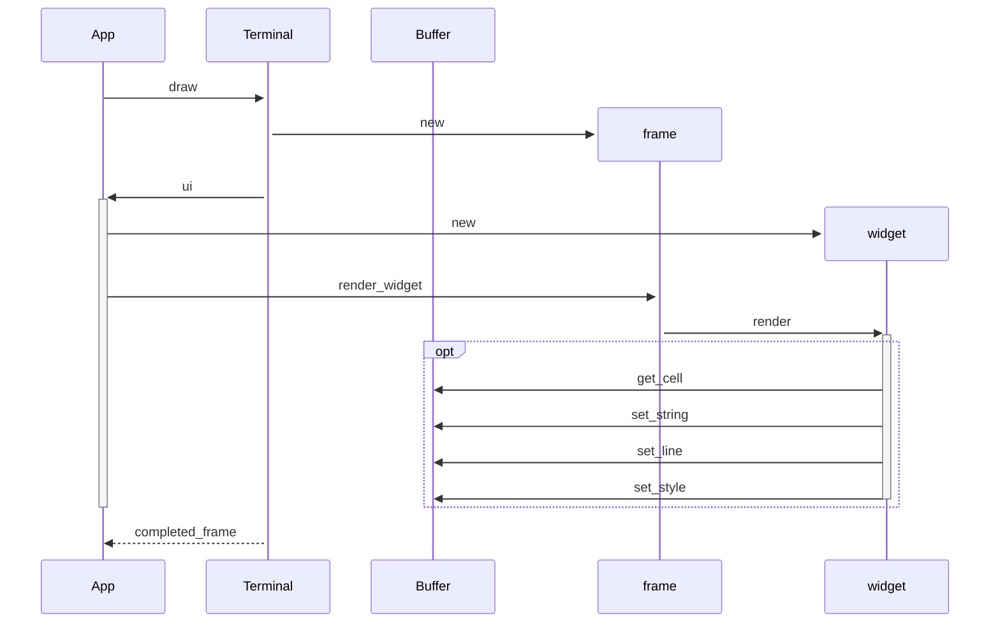

# How does Ratatui work under the hood?

You may have read in previous sections that Ratatui is a immediate mode rendering library. But what
does that really mean? And how is it implemented? In this section, we will discuss how Ratatui
renders a widget to the screen, starting with the `Terminal`'s `draw` method and ending with your
chosen backend library.

## Overview

To render an UI in Ratatui, your application calls the [`Terminal::draw()`] method. This method
takes a [closure] which accepts an instance of [`Frame`]. Inside the `draw` method, applications can
call [`Frame::render_widget()`] to render the state of a widget within the available renderable
area. We only discuss the `Frame::render_widget()` in this page but this discussion about rendering
applies equally to [`Frame::render_stateful_widget()`].

As an example, here is the `terminal.draw()` call for a simple "hello world" with Ratatui.

```rust
terminal.draw(|frame| {
    frame.render_widget(Paragraph::new("Hello World!"), frame.size());
});
```

The closure gets an argument `frame` of type `&mut Frame`.

`frame.size()` returns a `Rect` that represents the total renderable area. `Frame` also holds a
reference to a buffer which it can render widgets to using the `render_widget()` method. At the end
of the `draw` method (after the closure returns), Ratatui persists the content of the buffer to the
terminal. We will discuss more about `Buffer` later in this page.

[`Terminal::draw()`]:
  https://github.com/ratatui-org/ratatui/blob/e5caf170c8c304b952cbff7499fd4da17ab154ea/src/terminal.rs#L325-L360
[closure]: https://doc.rust-lang.org/stable/book/ch13-01-closures.html
[`Frame::render_widget()`]:
  https://github.com/ratatui-org/ratatui/blob/88ae3485c2c540b4ee630ab13e613e84efa7440a/src/terminal.rs#L596
[`Frame::render_stateful_widget()`]:
  https://github.com/ratatui-org/ratatui/blob/88ae3485c2c540b4ee630ab13e613e84efa7440a/src/terminal.rs#L628

## `Widget` trait

In Ratatui, the `frame.render_widget()` method calls a `Widget::render()` method on the struct. This
`Widget::render()` method is part of the [`Widget`] trait.

```rust
pub trait Widget {
    /// Draws the current state of the widget in the given buffer.
    fn render(self, area: Rect, buf: &mut Buffer);
}
```

[`Widget`]:
  https://github.com/ratatui-org/ratatui/blob/e5caf170c8c304b952cbff7499fd4da17ab154ea/src/widgets.rs#L107-L112

Any struct (inside Ratatui or third party crates) can implement the `Widget` trait, making an
instance of that struct renderable to the terminal. The `Widget::render()` method is the only method
required to make a struct a renderable widget.

<!--prettier-ignore-->
In the `Paragraph` example above, `frame.render_widget()` calls the
[`Widget::render()` method implemented for `Paragraph`].

[`Widget::render()` method implemented for `Paragraph`]:
  https://github.com/ratatui-org/ratatui/blob/88ae3485c2c540b4ee630ab13e613e84efa7440a/src/widgets/paragraph.rs#L213-L214

As a simple example, let's take a look at the builtin `Clear` widget. The `Clear` widget resets the
style information of every cell in the buffer back to the defaults. Here is the full implementation
for the `Clear` widget:

```rust
pub struct Clear;

impl Widget for Clear {
    fn render(self, area: Rect, buf: &mut Buffer) {
        for x in area.left()..area.right() {
            for y in area.top()..area.bottom() {
                buf.get_mut(x, y).reset();
            }
        }
    }
}
```

In the `Clear` widget example above, when the application calls the `Frame::render_widget()` method,
it will call the `Clear`'s `Widget::render()` method passing it the area (a `Rect` value) and a
mutable reference to the frame's [`Buffer`]. You can see that the `render` loops through the entire
area and calls `buf.get_mut(x, y).reset()`.

## Buffer

A `Buffer` represents a rectangular area that covers the Terminal's [`Viewport`] which the
application can draw into by manipulating its contents. A [`Buffer`] contains a collection of
[`Cell`]s to represent the rows and columns of the terminal's display area. Widgets interact with
these `Cell`s using `Buffer` methods.

Every time your application calls `terminal.draw(|frame| ...)`, Ratatui passes into the closure a
new instance of [`Frame`] which contains a mutable reference to an instance of `Buffer`. Ratatui
widgets render to this intermediate buffer before any information is written to the terminal. This
is in contrast to using a library like `crossterm` directly, where writing text to terminal can
occur immediately.

Here's a visual representation of a `Buffer` that is 12 `Cell`s wide and 4 `Cell`s tall.

```svgbob
        0     1     2     3     4     5     6     7     8     9    10    11
     ┌─────┬─────┬─────┬─────┬─────┬─────┬─────┬─────┬─────┬─────┬─────┬─────┐
   0 │  H  │  e  │  l  │  l  │  o  │     │  W  │  o  │  r  │  l  │  d  │  !  │
     ├─────┼─────┼─────┼─────┼─────┼─────┼─────┼─────┼─────┼─────┼─────┼─────┤
   1 │     │     │     │     │  ▲  │     │     │     │     │     │     │     │
     ├─────┼─────┼─────┼─────┼─ │ ─┼─────┼─────┼─────┼─────┼─────┼─────┼─────┤
   2 │     │     │     │     │  │  │     │     │     │     │     │     │     │
     ├─────┼─────┼─────┼─────┼─ │ ─┼─────┼─────┼─────┼─────┼─────┼─────┼─────┤
   3 │     │     │   ┌──────────┴──────────┐   │     │     │     │     │     │
     └─────┴─────┴── │ ┴─────┴─────┴─────┴ │ ──┴─────┴─────┴─────┴─────┴─────┘
                     │                     │
              ┌──────┴──────┐       ┌──────┴──────┐
              │   symbol    │       │    style    │
              │             │       │             │
              │     “o”     │       │ fg":"Reset  │
              │             │       │ bg":"Reset  │
              │             │       │             │
              └─────────────┘       └─────────────┘


```

In Ratatui, a `Cell` struct is the smallest renderable unit of code. Each `Cell` tracks symbol and
style information (foreground color, background color, modifiers etc). `Cell`s are similar to a
"pixel" in a graphical UI. Terminals generally render text so that each individual cell takes up
space approximately twice as high as it is wide. A `Cell` in Ratatui should usually contain 1 wide
string content.

`Buffer` implements methods to write text, set styles on particular areas and manipulate individual
cells. For example,

- `buf.get_mut(0, 0)` will return a `Cell` with the symbol and style information for row = 0 and col
  = 0.
- `buf.set_string(0, 0, "Hello World!", Style::default())` will render `hello world` into the
  `Buffer` starting at row = 0 and col = 0 with the style set to default for all those cells.

These methods allow any implementation of the `Widget` trait to write into different parts of the
`Buffer`.

What this means is that any content rendered to a `Buffer` is only stored in `Buffer` that is
attached to the frame during the `draw` call.

```admonish note
ANSI Escape sequences for color and style that are stored in the cell's string content are not
rendered as the style information is stored separately in the cell. If your text has ANSI styling
info, consider using the [`ansi-to-tui`](https://crates.io/crates/ansi-to-tui) crate to convert it
to a `Text` value before rendering. You can learn more about the text related Ratatui features and
displaying text [here](./../how-to/render/display-text.md).
```

## `flush()`

After the closure provided to the `draw` method finishes, the `draw` method calls
[`Terminal::flush()`]. This causes the buffer to be written to the screen. Ratatui uses a double
buffer approach so that it can use a diff to figure out which content to write to the terminal
screen efficiently.

`flush()` calculates the difference between the previous and the current buffer and passes it to the
current backend for drawing to the actual terminal. After `flush()`, Ratatui swaps the buffers and
the next time it calls `terminal.draw(|frame| ...)` it constructs `Frame` with the other `Buffer`.

The important thing to note is that because all widgets render to the same `Buffer` within a single
`terminal.draw(|frame| ...)` call, rendering of different widgets may overwrite the same `Cell`.
This means the order in which widgets are rendered will affect the final UI.

For example, in this `draw` example below, `"content1"` will be overwritten by `"content2"` which
will be overwritten by `"content3"` in `Buffer`, and Ratatui will only ever write out `"content3"`
to the terminal:

```rust
terminal.draw(|frame| {
    frame.render_widget(Paragraph::new("content1"), frame.size());
    frame.render_widget(Paragraph::new("content2"), frame.size());
    frame.render_widget(Paragraph::new("content3"), frame.size());
})
```

It's also important to note that each time an application calls `terminal.draw()` it must draw all
the widgets it expects to be rendered to the terminal, and not just a part of the frame.

## Conclusion

In summary, the application calls `terminal.draw(|frame| ...)`, and the terminal constructs a frame
that is passed to the closure provided by the application. The closure draws each widget to the
buffer by calling the `Frame::render_widget`, which in turn calls each widget's render method.
Finally, Ratatui writes the contents of the buffer to the terminal.



[`Cell`]:
  https://github.com/ratatui-org/ratatui/blob/e5caf170c8c304b952cbff7499fd4da17ab154ea/src/buffer.rs#L15-L26
[`Buffer`]:
  https://github.com/ratatui-org/ratatui/blob/e5caf170c8c304b952cbff7499fd4da17ab154ea/src/buffer.rs#L149-L157
[`Viewport`]:
  https://github.com/ratatui-org/ratatui/blob/88ae3485c2c540b4ee630ab13e613e84efa7440a/src/terminal.rs#L41-L65
[`Text`]:
  https://github.com/ratatui-org/ratatui/blob/e5caf170c8c304b952cbff7499fd4da17ab154ea/src/text/text.rs#L30-L33
[`Line`]:
  https://github.com/ratatui-org/ratatui/blob/e5caf170c8c304b952cbff7499fd4da17ab154ea/src/text/line.rs#L6-L10
[`Span`]:
  https://github.com/ratatui-org/ratatui/blob/e5caf170c8c304b952cbff7499fd4da17ab154ea/src/text/span.rs#L55-L61
[`render` method for `Block`]:
  https://github.com/ratatui-org/ratatui/blob/e5caf170c8c304b952cbff7499fd4da17ab154ea/src/widgets/block.rs#L752-L760
[`Frame`]:
  https://github.com/ratatui-org/ratatui/blob/e5caf170c8c304b952cbff7499fd4da17ab154ea/src/terminal.rs#L566-L578
[`Terminal::flush()`]:
  https://github.com/ratatui-org/ratatui/blob/e5caf170c8c304b952cbff7499fd4da17ab154ea/src/terminal.rs#L253-L263
[`get_mut`]:
  https://github.com/ratatui-org/ratatui/blob/88ae3485c2c540b4ee630ab13e613e84efa7440a/src/buffer.rs#L207-L211
[`set_string`]:
  https://github.com/ratatui-org/ratatui/blob/88ae3485c2c540b4ee630ab13e613e84efa7440a/src/buffer.rs#L289-L294
