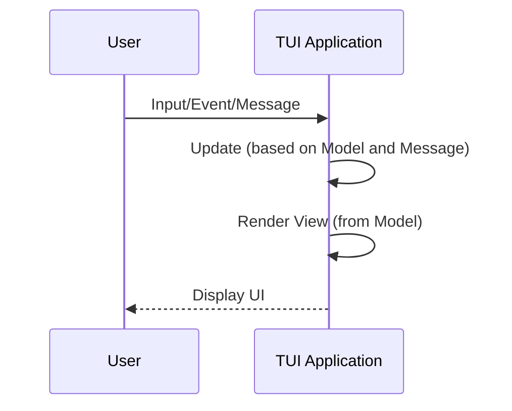

# Using The Elm Architecture (TEA) with `ratatui`

When building terminal user interfaces (TUI) with `ratatui`, it's helpful to have a solid structure
for organizing your application. One proven architecture comes from the Elm language, known simply
as The Elm Architecture (TEA).

In this post, we'll explore how to apply The Elm Architecture to `ratatui` TUI apps.

## The Elm Architecture: A Quick Overview

At its core, the Elm Architecture is split into three main components:

- **Model**: This is your application's state. It contains all the data your application works with.
- **Update**: When there's a change (like user input), the update function takes the current model
  and the input, and produces a new model.
- **View**: This function is responsible for displaying your model to the user. In Elm, it produces
  HTML. In our case, it'll produce terminal UI elements.



## Applying TEA to `ratatui`

1. Define Your Model

In `ratatui`, you'll typically use a `struct` to represent your model:

```rust
struct Model {
    //... your application's data goes here
}
```

2. Handling Updates

For our TUI app, an update happens when there's user input or some event we care about. With
`ratatui`, you'll handle keyboard or mouse input, and based on that, produce a new model.

```rust
enum Message {
    //... various inputs or actions that your app cares about
}

fn update(model: &Model, msg: Message) -> Model {
    match msg {
        //... handle each possible message
    }
}
```

3. Rendering the View

```rust
fn view(model: &Model) {
    //... use `ratatui` functions to draw your UI based on the model's state
}
```

## Putting it all together

When you put it all together, your main application loop might look something like:

- Listen for user input.
- Map input to a `Message`
- Pass that message to the update function.
- Draw the UI with the view function.

This cycle repeats, ensuring your TUI is always up-to-date with user interactions.

As an illustrative example, here's the [Counter App](./../tutorial/counter-app/single-function.md)
refactored using TEA.

The notable difference from before is that we have an `Model` struct that captures the app state,
and a `Message` enum that captures the various actions your app can take.

```rust
use anyhow::Result;
use ratatui::{
  prelude::{CrosstermBackend, Terminal},
  widgets::Paragraph,
};

// MODEL
struct Model {
  counter: i32,
  should_quit: bool,
}

// MESSAGES
enum Message {
  Increment,
  Decrement,
  Quit,
  None,
}

// UPDATE
fn update(model: &mut Model, msg: Message) {
  match msg {
    Message::Increment => model.counter += 1,
    Message::Decrement => model.counter -= 1,
    Message::Quit => model.should_quit = true, // You can handle cleanup and exit here
    Message::None => (),
  }
}

// VIEW
fn view(model: &Model, terminal: &mut Terminal<CrosstermBackend<std::io::Stderr>>) -> Result<()> {
  terminal
    .draw(|f| {
      f.render_widget(Paragraph::new(format!("Counter: {}", model.counter)), f.size());
    })?;
  Ok(())
}

// Convert Event to Message
// We don't need to pass in a `model` to this function in this example
// but you might need it as your project evolves
fn handle_event(_: &Model) -> Result<Message> {
  let message = if crossterm::event::poll(std::time::Duration::from_millis(250))? {
    if let crossterm::event::Event::Key(key) = crossterm::event::read()? {
      match key.code {
        crossterm::event::KeyCode::Char('j') => Message::Increment,
        crossterm::event::KeyCode::Char('k') => Message::Decrement,
        crossterm::event::KeyCode::Char('q') => Message::Quit,
        _ => Message::None,
      }
    } else {
      Message::None
    }
  } else {
    Message::None
  };
  Ok(message)
}

pub fn initialize_panic_handler() {
  std::panic::set_hook(Box::new(|panic_info| {
    crossterm::execute!(std::io::stderr(), crossterm::terminal::LeaveAlternateScreen).unwrap();
    crossterm::terminal::disable_raw_mode().unwrap();
    std::process::exit(libc::EXIT_FAILURE);
  }));
}

fn main() -> Result<()> {
  initialize_panic_handler();

  // Startup
  crossterm::terminal::enable_raw_mode()?;
  crossterm::execute!(std::io::stderr(), crossterm::terminal::EnterAlternateScreen)?;

  let mut terminal = Terminal::new(CrosstermBackend::new(std::io::stderr()))?;
  let mut model = Model { counter: 0, should_quit: false };

  loop {
    view(&model, &mut terminal)?;

    let msg = handle_event(&model)?;

    update(&mut model, msg);

    if model.should_quit {
      break;
    }
  }

  // Shutdown
  crossterm::execute!(std::io::stderr(), crossterm::terminal::LeaveAlternateScreen)?;
  crossterm::terminal::disable_raw_mode()?;
  Ok(())
}
```
