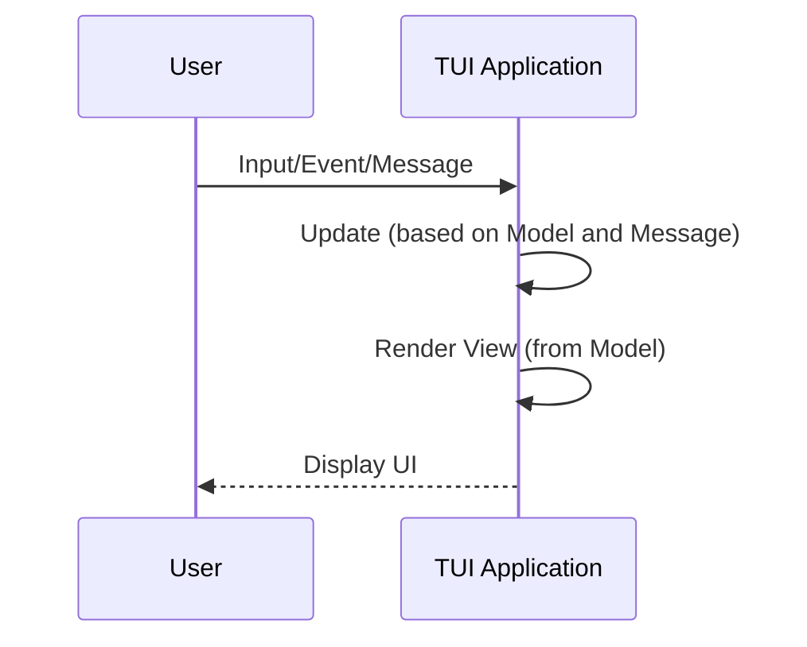
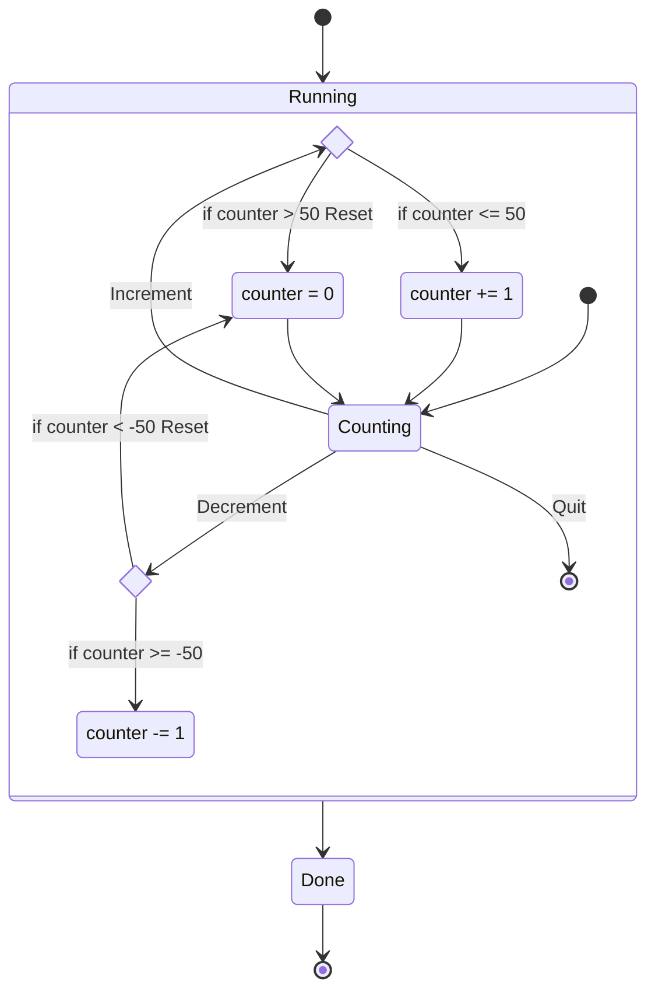

When building terminal user interfaces (TUI) with `ratatui`, it's helpful to have a solid structure
for organizing your application. One proven architecture comes from the Elm language, known simply
as The Elm Architecture (TEA).

:::tip

If you are interested in a framework that uses `ratatui` that is based on The Elm Architecture, you
should check out <https://github.com/veeso/tui-realm/>. The documentation on this page is for
theoretical understanding and pedagogical purposes only.

:::

In this section, we'll explore how to apply The Elm Architecture principles to `ratatui` TUI apps.

## The Elm Architecture: A Quick Overview

At its core, TEA is split into three main components:

- **Model**: This is your application's state. It contains all the data your application works with.
- **Update**: When there's a change (like user input), the update function takes the current model
  and the input, and produces a new model.
- **View**: This function is responsible for displaying your model to the user. In Elm, it produces
  HTML. In our case, it'll produce terminal UI elements.



## Applying The Elm Architecture to `ratatui`

Following TEA principles typically involves ensuring that you do the following things:

1. Define Your Model
2. Handling Updates
3. Rendering the View

### 1. Define Your Model

In `ratatui`, you'll typically use a `struct` to represent your model:

```rust
struct Model {
    //... your application's data goes here
}
```

For a counter app, our model may look like this:

```rust
{{ #include @code/concepts/the-elm-architecture/src/main.rs:model }}
```

### 2. Handling Updates

Updates in TEA are actions triggered by events, such as user inputs. The core idea is to map each of
these actions or events to a message. This can be achieved by creating an enum to keep track of
messages. Based on the received message, the current state of the model is used to determine the
next state.

**Defining a `Message` enum**

```rust
enum Message {
    //... various inputs or actions that your app cares about
    // e.g., ButtonPressed, TextEntered, etc.
}
```

For a counter app, our `Message` enum may look like this:

```rust
{{ #include @code/concepts/the-elm-architecture/src/main.rs:message }}
```

**`update()` function**

The update function is at the heart of this process. It takes the current model and a message, and
decides how the model should change in response to that message.

A key feature of TEA is immutability. Hence, the update function should avoid direct mutation of the
model. Instead, it should produce a new instance of the model reflecting the desired changes.

```rust
fn update(model: &Model, msg: Message) -> Model {
    match msg {
        // Match each possible message and decide how the model should change
        // Return a new model reflecting those changes
    }
}
```

In TEA, it's crucial to maintain a clear separation between the data (model) and the logic that
alters it (update). This immutability principle ensures predictability and makes the application
easier to reason about.

:::note

Hence, while immutability is emphasized in TEA, Rust developers can choose the most suitable
approach based on performance and their application's needs.

For example, it would be perfectly valid to do the following:

```rust
fn update(model: &mut Model, msg: Message) {
    match msg {
        // Match each possible message and decide how the model should change
        // Modify existing model reflecting those changes
    };
}
```

:::

In TEA, the `update()` function can not only modify the model based on the `Message`, but it can
also return another `Message`. This design can be particularly useful if you want to chain messages
or have an update lead to another update.

For example, this is what the `update()` function may look like for a counter app:

```rust
{{ #include @code/concepts/the-elm-architecture/src/main.rs:update }}
```

:::attention

Remember that this design choice means that the `main` loop will need to handle the returned
message, calling `update()` again based on that returned message.

:::

Returning a `Message` from the `update()` function allows a developer to reason about their code as
a "Finite State Machine". Finite State Machines operate on defined states and transitions, where an
initial state and an event (in our case, a `Message`) lead to a subsequent state. This cascading
approach ensures that the system remains in a consistent and predictable state after handling a
series of interconnected events.

Here's a state transition diagram of the counter example from above:



While TEA doesn't use the Finite State Machine terminology or strictly enforce that paradigm,
thinking of your application's state as a state machine can allow developers to break down intricate
state transitions into smaller, more manageable steps. This can make designing the application's
logic clearer and improve code maintainability.

### 3. Rendering the View

The view function in the Elm Architecture is tasked with taking the current model and producing a
visual representation for the user. In the case of ratatui, it translates the model into terminal UI
elements. It's essential that the view function remains a pure function: for a given state of the
model, it should always produce the same UI representation.

```rust
fn view(model: &Model) {
    //... use `ratatui` functions to draw your UI based on the model's state
}
```

Every time the model is updated, the view function should be capable of reflecting those changes
accurately in the terminal UI.

A view for a simple counter app might look like:

```rust
{{ #include @code/concepts/the-elm-architecture/src/main.rs:view }}
```

In TEA, you are expected to ensure that your view function is side-effect free. The `view()`
function shouldn't modify global state or perform any other actions. Its sole job is to map the
model to a visual representation.

For a given state of the model, the view function should always produce the same visual output. This
predictability makes your TUI application easier to reason about and debug.

:::note

With immediate mode rendering you may run into an issue: the `view` function is only aware of the
area available to draw in at render time.

This limitation is a recognized constraint of immediate mode GUIs. Overcoming it often involves
trade-offs. One common solution is to store the drawable size and reference it in the subsequent
frame, although this can introduce a frame delay in layout adjustments, leading to potential
flickering during the initial rendering when changes in screen size occur.

An alternative would be using the `Resize` event from `crossterm` and to clear the UI and force
redraw everything during that event.

:::

In `ratatui`, there are
[`StatefulWidget`s](https://docs.rs/ratatui/latest/ratatui/widgets/trait.StatefulWidget.html) which
require a mutable reference to state during render.

For this reason, you may choose to forego the `view` immutability principle. For example, if you
were interested in rendering a `List`, your `view` function may look like this:

```rust
fn view(model: &mut Model, f: &mut Frame) {
    let items = model.items.items.iter().map(|element| ListItem::new(element)).collect();
    f.render_stateful_widget(List::new(items), f.area(), &mut model.items.state);
}

fn main() {
    loop {
        ...
        terminal.draw(|f| view(&mut model, f) )?;
        ...
    }
}
```

Another advantage of having access to the `Frame` in the `view()` function is that you have access
to setting the cursor position, which is useful for displaying text fields. For example, if you
wanted to draw an input field using [`tui-input`](https://github.com/sayanarijit/tui-input), you
might have a `view` that looks like this:

```rust
fn view(model: &mut Model, f: &mut Frame) {
    let area = f.area();
    let input = Paragraph::new(app.input.value());
    f.render_widget(input, area);
    if model.mode == Mode::Insert {
        f.set_cursor(
            (area.x + 1 + self.input.cursor() as u16).min(area.x + area.width - 2),
            area.y + 1
        )
    }
}
```

## Putting it all together

When you put it all together, your main application loop might look something like:

- Listen for user input.
- Map input to a `Message`
- Pass that message to the update function.
- Draw the UI with the view function.

This cycle repeats, ensuring your TUI is always up-to-date with user interactions.

As an illustrative example, here's the [Counter App](/tutorials/counter-app/) refactored using TEA.

The notable difference from before is that we have a `Model` struct that captures the app state,
and a `Message` enum that captures the various actions your app can take.

```rust
{{ #include @code/concepts/the-elm-architecture/src/main.rs }}
```
