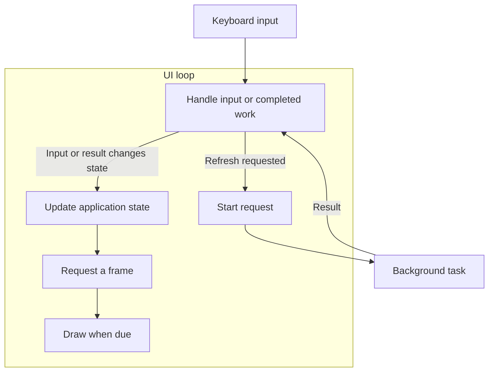

Consider a terminal app that displays a list of items fetched from a server. Pressing `r` refreshes
the list. While the request waits, the app should display a loading status and keep accepting input.
When data arrives, the list should update without another keypress. If the request fails, the old
list should remain visible beside an error.

The [background fetch example](/recipes/apps/background-fetch/) implements that behavior with a
two-second simulated fetch, so it needs no server. Its counter, changed with `+` and `-`, makes it
easy to see whether input still works while loading. It allows one fetch at a time and ignores
repeated refreshes until that fetch finishes. The loop below coordinates this refresh operation with
counter input and drawing.

## Events and application state

An **event loop** coordinates the refresh and the other input: it waits for an event, updates
application state, and draws changes. The loading flag, fetched items, error, and counter all belong
to the UI state. A refresh starts work; its completion later supplies another event for the loop.

One arrangement gives the request its own task. The UI loop starts that task, then returns to
waiting for input or the result:



Calling an async request function creates a **future**: a value representing work that progresses
when polled. Spawning that future gives Tokio a **task** to schedule independently of the UI loop.
The UI loop can then wait for keyboard input and the task's result together. Awaiting the request
directly inside the key handler would keep that handler waiting until the request finishes,
preventing the loop from handling another event.

A task does not need its own thread. Tokio can run several tasks on one thread, giving other work an
opportunity to run while a request waits for network data. The request and the UI can therefore make
progress during the same period without executing at the same instant.

:::note[Drawing still blocks the UI loop]

When the result arrives, the UI loop updates its state and requests a frame. Ratatui's
[`Terminal::draw`] renders and writes that frame synchronously: the UI loop cannot handle another
event until drawing returns.

:::

## Input, results, and drawing

The UI task waits for input, the pending request's result, or a frame deadline. A frame deadline is
the earliest time it should draw again; spacing frames lets several changes appear together. Input
and request completion can each wake the task before that deadline.

Each selection waits for input, a request result, and a frame deadline together. It runs one ready
branch, then starts the next loop turn. A keypress does not make the request task disappear; the
loop can wait for its result again.

This pseudocode keeps the refresh, counter input, and drawing in one loop. The
[complete example](/recipes/apps/background-fetch/) also covers startup, errors, and cleanup.

```text
while running:
    select:
        input = await next_input():
            if input is Refresh:
                if not loading: spawn fetch()
                else: ignore repeated refresh
            else: apply_input(input)
        result = await next_worker_result(), if a worker exists:
            apply_result(result)
        await frame_deadline(), if redraw_requested:
            draw()                 # Synchronous: this UI task waits.
            clear_redraw_request()
            reset_frame_deadline()
```

Applying input or a result requests a redraw when visible state changes. Spawning the fetch lets the
UI task return to selection while the request waits. The
[async event-loop example](/recipes/apps/background-fetch/) implements this arrangement with
[`EventStream`], [`JoinSet`], and [`select!`].

## Wakeups and UI ownership

In this loop, input, request completion, and the frame timer each provide a reason to wake. If the
loop waited only for a key, a finished refresh could remain invisible until the user pressed one.
Likewise, changing data shared with the UI is not enough on its own: the loop needs notification
that there is something to apply and draw.

The UI loop applies results and input to the same state before rendering. A worker can own its
request data without acquiring a lock on the whole application. This also gives one place to decide
whether an old result still belongs to the current view.

:::caution[Terminal input has one owner]

Crossterm requires [`poll`] and [`read`] on the same thread, or an `EventStream`, without mixing
those strategies. A separate input task still shares the terminal with queries and child programs.
[Terminal I/O](/concepts/async/terminal-io/) explains the coordination this requires.

:::

The refresh task returns data; the UI decides how to apply it.
[Tasks and Results](/concepts/async/tasks/) explains that ownership and the completion path. A
separate task is one arrangement: a loop can also
[retain a pending operation directly](/concepts/async/tasks/#concurrent-operations-in-one-task).

An existing synchronous UI can keep its input loop and use async workers. The comparison and
[synchronous loop sketch](/concepts/async/bridging/#synchronous-ui-with-async-workers) are in
Bridging Sync and Async.

[`Terminal::draw`]: https://docs.rs/ratatui/latest/ratatui/struct.Terminal.html#method.draw
[`EventStream`]: https://docs.rs/crossterm/latest/crossterm/event/struct.EventStream.html
[`JoinSet`]: https://docs.rs/tokio/latest/tokio/task/struct.JoinSet.html
[`select!`]: https://docs.rs/tokio/latest/tokio/macro.select.html
[`poll`]: https://docs.rs/crossterm/latest/crossterm/event/fn.poll.html
[`read`]: https://docs.rs/crossterm/latest/crossterm/event/fn.read.html
