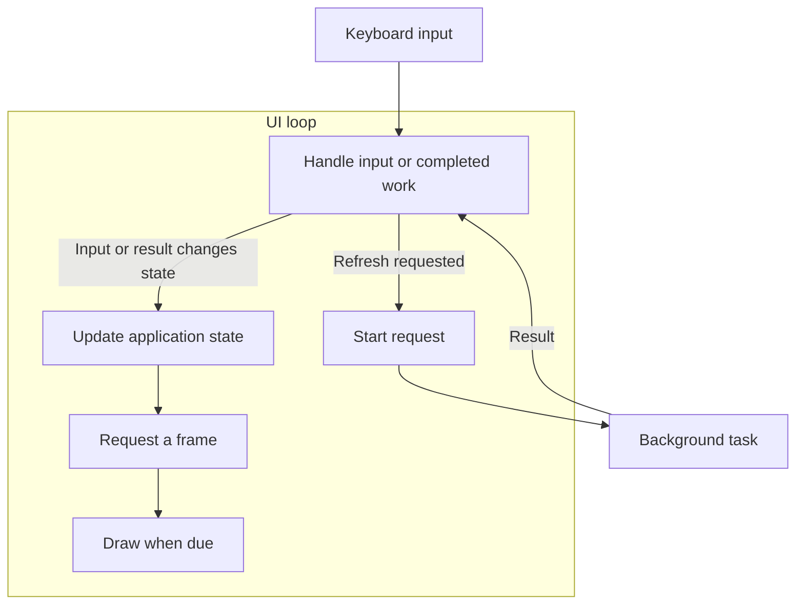

A TUI might fetch data, follow a process log, or search a large collection while accepting input.
Async Rust provides ways to wait for that work without occupying a thread for each wait. You still
choose how results reach the UI, when to draw, and what happens when the user changes their mind.

In a Tokio-based app, background tasks return results to the UI loop, which processes Crossterm
input and draws application state with Ratatui. The loop must wake for both input and completed
work, and terminal queries must coordinate with the input reader. These requirements also apply to
[Elm, components, and other application patterns](/concepts/application-patterns/).

## Async topics

| Need                              | Page                       |
| --------------------------------- | -------------------------- |
| Input while work is pending       | [Event loops][loops]       |
| Scheduling and responsiveness     | [Scheduling][schedule]     |
| Concurrent requests and results   | [Background work][workers] |
| Queries and input ownership       | [Terminal I/O][terminal]   |
| Quit, launch an editor, or resume | [Lifecycle][lifecycle]     |
| Investigate a failure             | [Troubleshooting][trouble] |
| Improve library coordination      | [Design questions][design] |

## Tasks and the UI loop

Suppose pressing a key starts a network request. The UI must keep accepting input while the request
waits, then display the result when it arrives. An **event loop** coordinates these events: it waits
for input or completed work, updates application state, and draws changes.

In this arrangement, the UI loop owns the state and terminal. It starts the request as a separate
task, then returns to waiting for events:

Calling an async request function creates a **future**: a value representing work that progresses
when polled. Spawning that future gives Tokio a **task** to schedule independently of the UI loop.
The UI can then wait for keyboard input and the task's result together. Awaiting the request
directly inside the key handler would keep that handler waiting until the request finishes,
preventing the loop from handling another event.

A task does not need its own **thread**. Tokio can run several tasks on one thread, switching
between them when they return control. While the request awaits network data that is not yet
available, its thread can run other tasks. An `.await` on an already-ready future can continue
immediately, though, so it does not guarantee a switch. This is
[cooperative scheduling](/concepts/async/scheduling/#cooperative-scheduling).

:::note[Drawing still blocks the UI loop]

When the result arrives, the UI loop updates its state and requests a frame. Ratatui's
[`Terminal::draw`] renders and writes that frame synchronously: the UI loop cannot handle another
event until drawing returns. The placement of the UI loop therefore matters. A slow draw on a
runtime thread can also delay other tasks scheduled on that thread; a separate UI thread keeps that
blocking work off the runtime.

:::

## Terminal ownership

Keep terminal operations ordered and give worker results a way to reach the event loop. These are
three arrangements with different waiting and lifecycle costs:

| Arrangement               | Main tradeoff                                       |
| ------------------------- | --------------------------------------------------- |
| One async UI task         | Wait on several sources; drawing blocks the task    |
| Sync UI, async workers    | Isolate terminal calls; arrange result wakeups      |
| Dedicated terminal thread | Isolate blocking work; design commands and shutdown |

A plain synchronous loop is enough when handlers finish promptly. A separate input task is also
possible, but it must participate in terminal queries and handoffs; simply putting input and output
in different tasks does not make them independent.

:::caution[Use one Crossterm input strategy]

Crossterm's [event API][event module] requires using `poll` and `read` on the same thread, or using
`EventStream`, without mixing the two approaches. Keeping terminal access in one part of the
application helps enforce this restriction during startup, queries, and shutdown.

:::

## Examples and sources

[The runnable example](/concepts/async/event-loops/) demonstrates input, loading, success, failure,
and exit without a server or credentials. Its simulated fetch makes the waiting behavior repeatable.
Other snippets isolate particular mechanisms and state their assumptions beside the code.

Source links refer to specific application revisions so you can inspect the surrounding code. For
example, the scheduling discussion compares how Yazi batches events, Codex combines redraw requests,
and dua-cli limits queued traversal results.

[Tokio's tutorial](https://tokio.rs/tokio/tutorial) introduces futures, tasks, and channels in more
detail.

[`Terminal::draw`]: https://docs.rs/ratatui/latest/ratatui/struct.Terminal.html#method.draw
[event module]: https://docs.rs/crossterm/latest/crossterm/event/index.html
[loops]: /concepts/async/event-loops/
[schedule]: /concepts/async/scheduling/
[workers]: /concepts/async/background-work/
[terminal]: /concepts/async/terminal-io/
[lifecycle]: /concepts/async/lifecycle/
[trouble]: /concepts/async/troubleshooting/
[design]: /concepts/async/design-questions/
