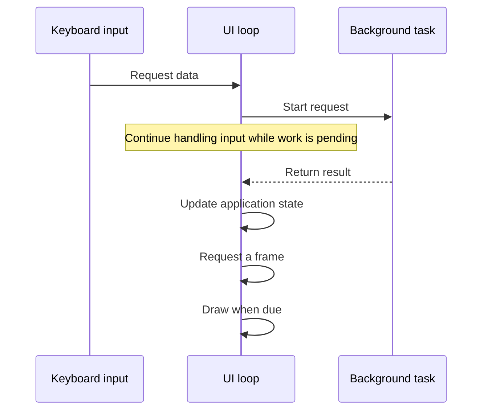

A TUI might fetch data, follow a process log, or search a large collection while accepting input.
Async Rust provides ways to wait for that work without occupying a thread for each wait. You still
choose how results reach the UI, when to draw, and what happens when the user changes their mind.

In a Tokio-based app, background tasks return results to the UI loop, which processes Crossterm
input and draws application state with Ratatui. The loop must wake for both input and completed
work, and terminal queries must coordinate with the input reader. These requirements also apply to
[Elm, components, and other application patterns](/concepts/application-patterns/).

## Async topics

| Need                              | Page                       |
| --------------------------------- | -------------------------- |
| Input while work is pending       | [Event loops][loops]       |
| Scheduling and responsiveness     | [Scheduling][schedule]     |
| Concurrent requests and results   | [Background work][workers] |
| Queries and input ownership       | [Terminal I/O][terminal]   |
| Quit, launch an editor, or resume | [Lifecycle][lifecycle]     |
| Investigate a failure             | [Troubleshooting][trouble] |
| Improve library coordination      | [Design questions][design] |

## Tasks and the UI loop

The UI loop can own application state and the terminal while workers return results for it to apply.
A background request then follows this sequence:

A **future** represents an operation that can make progress when polled. A **task** is a future
scheduled by a runtime such as Tokio. A **thread** executes code; several tasks can take turns on
one thread. An **event loop** waits for input or other changes and dispatches them to handlers.

An `.await` is an opportunity to give control back to the runtime while waiting. A ready future can
continue immediately, so adding `.await` does not guarantee that another task runs. See
[cooperative scheduling](/concepts/async/scheduling/#cooperative-scheduling).

Ratatui's [`Terminal::draw`] remains synchronous. Widget rendering, backend calls, and flushing
occupy the calling thread until the operation returns. Awaitable input does not make drawing async,
and a task reading events may share terminal input with a cursor-position query. The
[terminal I/O page](/concepts/async/terminal-io/) explains those interactions.

## Terminal ownership

Keep terminal operations ordered and give worker results a way to reach the event loop. These are
three arrangements with different waiting and lifecycle costs:

| Arrangement               | Main tradeoff                                       |
| ------------------------- | --------------------------------------------------- |
| One async UI task         | Wait on several sources; drawing blocks the task    |
| Sync UI, async workers    | Isolate terminal calls; arrange result wakeups      |
| Dedicated terminal thread | Isolate blocking work; design commands and shutdown |

A plain synchronous loop is enough when handlers finish promptly. A separate input task is also
possible, but it must participate in terminal queries and handoffs; simply putting input and output
in different tasks does not make them independent.

Crossterm's [event API][event module] requires using `poll` and `read` on the same thread, or using
`EventStream`, without mixing the two approaches. Keeping terminal access in one part of the
application helps enforce this restriction during startup, queries, and shutdown.

## Examples and sources

[The runnable example](/concepts/async/event-loops/) demonstrates input, loading, success, failure,
and exit without a server or credentials. Its simulated fetch makes the waiting behavior repeatable.
Other snippets isolate particular mechanisms and state their assumptions beside the code.

Source links refer to specific application revisions so you can inspect the surrounding code. For
example, the scheduling discussion compares how Yazi batches events, Codex combines redraw requests,
and dua-cli limits queued traversal results.

[Tokio's tutorial](https://tokio.rs/tokio/tutorial) introduces futures, tasks, and channels in more
detail.

[`Terminal::draw`]: https://docs.rs/ratatui/latest/ratatui/struct.Terminal.html#method.draw
[event module]: https://docs.rs/crossterm/latest/crossterm/event/index.html
[loops]: /concepts/async/event-loops/
[schedule]: /concepts/async/scheduling/
[workers]: /concepts/async/background-work/
[terminal]: /concepts/async/terminal-io/
[lifecycle]: /concepts/async/lifecycle/
[trouble]: /concepts/async/troubleshooting/
[design]: /concepts/async/design-questions/
