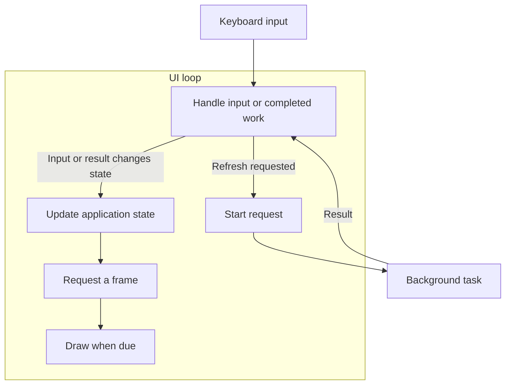

A TUI might fetch data, follow a process log, or search a large collection while accepting input.
Async Rust provides ways to wait for that work without occupying a thread for each wait. You still
choose how results reach the UI, when to draw, and what happens when the user changes their mind.

In a Tokio-based app, background tasks return results to the UI loop, which processes Crossterm
input and draws application state with Ratatui. The loop must wake for both input and completed
work, and terminal queries must coordinate with the input reader. These requirements also apply to
[Elm, components, and other application patterns](/concepts/application-patterns/).

## Async topics

- [Async Applications](#tasks-and-the-ui-loop) introduces the request flow and UI arrangements.
  - Tasks and the UI loop: how futures, tasks, and threads participate in a background request.
  - Terminal ownership: compare async and synchronous loops, including a dedicated UI thread.
- [Build a Responsive Event Loop][loops] walks through a runnable application.
  - Run the example: controls, dependencies, and complete source.
  - State and requests: keep display state and pending tasks in `App`.
  - Event selection: wait for input, results, or a frame deadline.
  - Results and cleanup: display failures, restore the terminal, and stop workers.
  - Synchronous alternative: poll input and receive results from async workers.
  - Existing applications: compare loops in Ratatui examples, templates, and bottom.
- [Schedule Work and Redraws][schedule] explains what affects responsiveness.
  - Cooperative scheduling: when tasks yield and which thread drawing blocks.
  - Expensive work: measure application, rendering, and backend costs; limit blocking jobs.
  - Batching: apply bounded amounts of input and worker results before drawing.
  - Frame deadlines: combine redraw requests and avoid unnecessary idle frames.
  - Coalescing and debouncing: decide which updates can be replaced and when to start work.
- [Background Work and Messages][workers] covers communication and result handling.
  - Worker messages: deliver results and errors to the UI and wake its loop.
  - Channels: choose delivery guarantees and backpressure with `mpsc`, `watch`, or `oneshot`.
  - Actors: send commands to a task that owns a resource and receive its replies.
  - Stale results: prevent an older search from replacing a newer result.
  - Cancellation: account for partial progress, task lifetimes, and external effects.
- [Terminal I/O and Ownership][terminal] explains coordination at the terminal.
  - Synchronous drawing: distinguish rendering, size checks, output, and queries.
  - Protocol replies: understand how queries share input with keyboard and mouse events.
  - Startup and runtime queries: order probes and coordinate with the active reader.
  - Redirection: identify the actual terminal handles and the behavior of I/O wrappers.
- [Shutdown and Terminal Handoffs][lifecycle] covers exit and temporary release of the terminal.
  - Error cleanup: restore terminal modes when the event loop fails.
  - Worker shutdown: stop accepting work, signal cancellation, and join tasks.
  - Blocking jobs: wait for completion even when the result is no longer wanted.
  - Child processes: release input and modes, run another program, and rebuild the display.
  - Suspend and resume: recover terminal state after shell job control.
- [Troubleshooting Async Applications][trouble] connects symptoms to investigations.
  - Timing: distinguish slow requests, missing wakeups, and delayed frames.
  - Load and ordering: reproduce queue backlogs, stale results, and shutdown during work.
  - Reader conflicts: isolate queries and compare documented terminal failures.
  - Tests: choose unit, pseudo-terminal, or real-terminal checks for the failing behavior.
- [Async Terminal Design Questions][design] discusses possible library improvements.
  - Query routing: match replies while preserving ordinary input.
  - Rendering and presentation: separate preparing a frame from writing it to the terminal.
  - Redraw scheduling: coordinate requests from multiple components.
  - Release and reacquisition: define terminal handoff operations.
  - Reader lifecycle: establish shutdown guarantees across platforms.
  - Regression tests: exercise protocol handling, handoffs, resize, and resume.

## Tasks and the UI loop

Suppose pressing a key starts a network request. The UI must keep accepting input while the request
waits, then display the result when it arrives. An **event loop** coordinates these events: it waits
for input or completed work, updates application state, and draws changes.

In this arrangement, the UI loop owns the state and terminal. It starts the request as a separate
task, then returns to waiting for events:



Calling an async request function creates a **future**: a value representing work that progresses
when polled. Spawning that future gives Tokio a **task** to schedule independently of the UI loop.
The UI can then wait for keyboard input and the task's result together. Awaiting the request
directly inside the key handler would keep that handler waiting until the request finishes,
preventing the loop from handling another event.

A task does not need its own **thread**. Tokio can run several tasks on one thread, switching
between them when they return control. While the request awaits network data that is not yet
available, its thread can run other tasks. An `.await` on an already-ready future can continue
immediately, though, so it does not guarantee a switch. This is
[cooperative scheduling](/concepts/async/scheduling/#cooperative-scheduling).

:::note[Drawing still blocks the UI loop]

When the result arrives, the UI loop updates its state and requests a frame. Ratatui's
[`Terminal::draw`] renders and writes that frame synchronously: the UI loop cannot handle another
event until drawing returns. The placement of the UI loop therefore matters. A slow draw on a
runtime thread can also delay other tasks scheduled on that thread; a separate UI thread keeps that
blocking work off the runtime.

:::

## Terminal ownership

The request flow above works with either an async or a synchronous UI loop. In both arrangements,
the UI loop owns application state and drawing; background tasks return results for it to apply. The
difference is how the loop waits:

| UI loop                           | Waiting mechanism                                   |
| --------------------------------- | --------------------------------------------------- |
| Async UI task                     | Awaits input, results, and frame deadlines together |
| Synchronous UI with async workers | Polls input and checks a result channel             |

The sketches below use the same operation: a refresh starts a background fetch, and its result
updates the UI. They are pseudocode, not compilable Rust. Error handling, initial drawing, and
worker cleanup are omitted here; the [runnable example][loops] includes them.

### Async UI task

The UI task awaits several sources together. Input and worker completion can each wake it:

```text
while running:
    select:
        input = await next_input():
            if input is Refresh: spawn fetch()
            else: apply_input(input)
        result = await next_worker_result(), if a worker exists:
            apply_result(result)
        await frame_deadline(), if redraw_requested:
            draw()                 # Synchronous: this UI task waits.
            clear_redraw_request()
            reset_frame_deadline()
```

Applying input or a result requests a redraw when visible state changes. Spawning the fetch lets the
UI task return to selection while the request waits. The
[async event-loop example](/concepts/async/event-loops/#wait-for-input-results-or-a-frame)
implements this arrangement with `EventStream`, `JoinSet`, and `select!`.

### Synchronous UI with async workers

The UI thread polls input and checks a result channel. A multi-thread Tokio runtime executes the
fetches while the UI thread waits:

```text
start multi_thread_runtime
while running:
    if poll_input(timeout_until_next_check_or_frame):
        for input in bounded_input_batch():
            if input is Refresh:
                runtime.spawn(fetch_and_send_result())
            else: apply_input(input)
    for result in bounded_result_batch():
        apply_result(result)
    if redraw_requested and frame_due:
        draw()                     # Blocks the UI thread, not runtime workers.
        clear_redraw_request()
        reset_frame_deadline()
```

A worker's channel send cannot wake Crossterm's `poll`, so the input timeout also limits how long
the loop waits before checking results. This is the main difference from awaiting all sources with
`select!`. The [synchronous example](/concepts/async/event-loops/#synchronous-ui-with-async-workers)
supplies the polling and batch limits.

### Dedicated UI thread

The same synchronous loop can run on a dedicated thread. Its waiting behavior stays the same; the
application additionally needs a way to send commands and wait for that thread to exit:

```text
start multi_thread_runtime
create ui_command_channel
ui_thread = start_thread:
    initialize_terminal()
    run_synchronous_ui_loop(runtime_handle, ui_commands):
        check_commands_each_turn() # Poll timeout also bounds command-check delay.
        on Refresh: runtime.spawn(fetch_and_send_result())
        on worker_result: apply_result_and_request_redraw()
        on Stop: leave_loop()
        draw_when_due()            # Runs on this UI thread.
    restore_terminal()             # Also on an error from the loop.
send_ui_command(Refresh)
... application continues ...
send_ui_command(Stop)
join_ui_thread()                   # Blocking: keep off runtime worker threads.
finish_worker_shutdown()
```

Initialize, draw, and restore on the UI thread. Its command checks share the loop with input and
worker results, so a stop command must not depend on another keypress. A draw already in progress
still has to return before the loop can process that command. Worker shutdown follows the
[operation's cleanup policy](/concepts/async/lifecycle/#worker-shutdown).

If the app has no background work and its input handlers finish promptly, a synchronous loop can
also run without an async runtime.

### Separate input readers

Input ownership is a further choice within either arrangement. A separate input task or thread can
forward events to the UI loop, but it still reads from the same terminal that receives query replies
and child-program input. It must coordinate with [terminal queries](/concepts/async/terminal-io/)
and stop before a
[child-program handoff](/concepts/async/lifecycle/#terminal-handoff-to-a-child-process). Moving
input out of the UI loop therefore adds coordination beyond choosing how that loop waits.

:::caution[Use one Crossterm input strategy]

Crossterm's [event API][event module] requires using `poll` and `read` on the same thread, or using
`EventStream`, without mixing the two approaches. Keeping terminal access in one part of the
application helps enforce this restriction during startup, queries, and shutdown.

:::

## Examples and sources

[The runnable example](/concepts/async/event-loops/) demonstrates input, loading, success, failure,
and exit without a server or credentials. Its simulated fetch makes the waiting behavior repeatable.
Other snippets isolate particular mechanisms and state their assumptions beside the code.

Source links refer to specific application revisions so you can inspect the surrounding code. For
example, the scheduling discussion compares how Yazi batches events, Codex combines redraw requests,
and dua-cli limits queued traversal results.

[Tokio's tutorial](https://tokio.rs/tokio/tutorial) introduces futures, tasks, and channels in more
detail.

[`Terminal::draw`]: https://docs.rs/ratatui/latest/ratatui/struct.Terminal.html#method.draw
[event module]: https://docs.rs/crossterm/latest/crossterm/event/index.html
[loops]: /concepts/async/event-loops/
[schedule]: /concepts/async/scheduling/
[workers]: /concepts/async/background-work/
[terminal]: /concepts/async/terminal-io/
[lifecycle]: /concepts/async/lifecycle/
[trouble]: /concepts/async/troubleshooting/
[design]: /concepts/async/design-questions/
