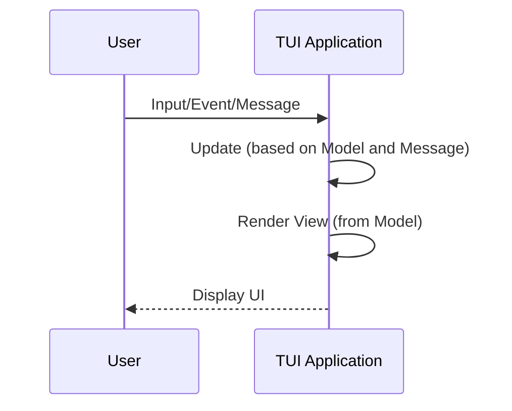

[ratatui.rs](https://ratatui.rs) is built with [`Astro`](https://astro.build/) and
[`Starlight`](https://starlight.astro.build).

The source is available from the
[ratatui/ratatui-website](https://github.com/ratatui/ratatui-website) GitHub repository.

If you would like to contribute, you can make a fork and clone the repository. Make sure you run the
following [`git lfs`] commands before making a PR.

```shell title="install git lfs"
git lfs install
git lfs pull
```

[`git lfs`]: ../git-guide/

To build and run the site locally:

```shell title="install necessary packages"
npm install
```

```shell title="run site"
npm run dev
```

Feel free to make contributions and submit a PR if you'd like to improve the documentation.

## Some Guidelines

- Prefer links from the root rather than using multiple levels of parent links. (e.g.
  `/concepts/backends/comparison/` instead of `../../backends/comparison/`).
- Prefer to add the last slash on links

## Astro and Starlight features

Starlight supports the full range of Markdown syntax in `.md` files as well as meta information for
titles and descriptions in YAML frontmatter.

See [starlight] for more information on how to author content in markdown.

[starlight]: https://starlight.astro.build/guides/authoring-content/

## Custom components

The website uses custom components and features to make it easier to generate high quality
documentation that is more maintainable.

### LinkBadge

Use the `LinkBadge` component:

```markdown
import LinkBadge from "/src/components/LinkBadge.astro";

<LinkBadge text="default" href="" variant="default" />
<LinkBadge text="outline" href="" variant="outline" />
<LinkBadge text="note" href="" variant="note" />
<LinkBadge text="danger" href="" variant="danger" />
<LinkBadge text="success" href="" variant="success" />
<LinkBadge text="caution" href="" variant="caution" />
<LinkBadge text="tip" href="" variant="tip" />
```

This renders as:

import LinkBadge from "/src/components/LinkBadge.astro";

<LinkBadge text="default" href="" variant="default" />
<LinkBadge text="outline" href="" variant="outline" />
<LinkBadge text="note" href="" variant="note" />
<LinkBadge text="danger" href="" variant="danger" />
<LinkBadge text="success" href="" variant="success" />
<LinkBadge text="caution" href="" variant="caution" />
<LinkBadge text="tip" href="" variant="tip" />

### Code include

Use the `remark-include-code` plugin to include code from a test file:

````markdown include=ignore
```rust
{{#include @code/tutorials/hello-ratatui/src/main.rs}}
```
````

This renders as:

```rust
{{#include @code/tutorials/hello-ratatui/src/main.rs}}
```

### svgbob

Draw diagrams with [`svgbob`]:

[`svgbob`]: https://github.com/ivanceras/svgbob

````markdown
```svgbob
 ,-------------.
 |Get Key Event|
 `-----+-------'
       |
       |
 ,-----v------.
 |Update State|
 `-----+------'
       |
       |
   ,---v----.
   | Render |
   `--------'
```
````

This renders as:

```svgbob
 ,-------------.
 |Get Key Event|
 `-----+-------'
       |
       |
 ,-----v------.
 |Update State|
 `-----+------'
       |
       |
   ,---v----.
   | Render |
   `--------'
```

### mermaidjs

Draw diagrams with [`mermaidjs`]:

[`mermaidjs`]: https://mermaid.js.org/

````markdown

````

This renders as:


