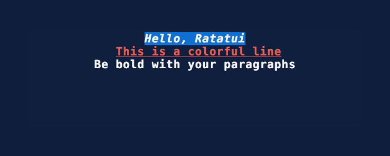

import LinkBadge from "/src/components/LinkBadge.astro";

The following widgets are built-in and available in the `ratatui` crate. They are all documented in
the [API docs](https://docs.rs/ratatui/latest/ratatui/widgets/index.html).

:::note

These screenshots are created using the [widget-showcase] project and [VHS]. Refer to these projects
if you’d like to contribute.

:::

[widget-showcase]:
  https://github.com/ratatui/ratatui-website/tree/main/code/showcase/widget-showcase
[VHS]: https://github.com/charmbracelet/vhs

## Block <LinkBadge href="https://docs.rs/ratatui/latest/ratatui/widgets/block/struct.Block.html" text="Docs" /> <LinkBadge href="https://ratatui.rs/examples/widgets/block/" text="Example Code" />

## BarChart <LinkBadge href="https://docs.rs/ratatui/latest/ratatui/widgets/struct.BarChart.html" text="Docs" /> <LinkBadge href="https://ratatui.rs/examples/widgets/barchart/" text="Example Code" />

## Calendar <LinkBadge href="https://docs.rs/ratatui/latest/ratatui/widgets/calendar/struct.Monthly.html" text="Docs" /> <LinkBadge href="https://ratatui.rs/examples/widgets/calendar/" text="Example Code" />

## Canvas <LinkBadge href="https://docs.rs/ratatui/latest/ratatui/widgets/canvas/struct.Canvas.html" text="Docs" /> <LinkBadge href="https://ratatui.rs/examples/widgets/canvas/" text="Example Code" />

## Chart <LinkBadge href="https://docs.rs/ratatui/latest/ratatui/widgets/struct.Chart.html" text="Docs" /> <LinkBadge href="https://ratatui.rs/examples/widgets/chart/" text="Example Code" />

## Gauge <LinkBadge href="https://docs.rs/ratatui/latest/ratatui/widgets/struct.Gauge.html" text="Docs" /> <LinkBadge href="https://ratatui.rs/examples/widgets/gauge/" text="Example Code" />

## LineGauge <LinkBadge href="https://docs.rs/ratatui/latest/ratatui/widgets/struct.LineGauge.html" text="Docs" />

## List <LinkBadge href="https://docs.rs/ratatui/latest/ratatui/widgets/struct.List.html" text="Docs" /> <LinkBadge href="https://ratatui.rs/examples/widgets/list/" text="Example Code" />

## Paragraph <LinkBadge href="https://docs.rs/ratatui/latest/ratatui/widgets/struct.Paragraph.html" text="Docs" /> <LinkBadge href="https://ratatui.rs/examples/widgets/paragraph/" text="Example Code" />

## Scrollbar <LinkBadge href="https://docs.rs/ratatui/latest/ratatui/widgets/struct.Scrollbar.html" text="Docs" /> <LinkBadge href="https://docs.rs/ratatui/latest/ratatui/widgets/struct.Scrollbar.html" text="Example Code" />

## Sparkline <LinkBadge href="https://docs.rs/ratatui/latest/ratatui/widgets/struct.Sparkline.html" text="Docs" /> <LinkBadge href="https://ratatui.rs/examples/widgets/sparkline/" text="Example Code" />

## Table <LinkBadge href="https://docs.rs/ratatui/latest/ratatui/widgets/struct.Table.html" text="Docs" /> <LinkBadge href="https://ratatui.rs/examples/widgets/table/" text="Example Code" />

## Tabs <LinkBadge href="https://docs.rs/ratatui/latest/ratatui/widgets/struct.Tabs.html" text="Docs" /> <LinkBadge href="https://ratatui.rs/examples/widgets/tabs/" text="Example Code" />

## Third Party Widgets

See the next page for a showcase of [third party widgets](../third-party-widgets).
