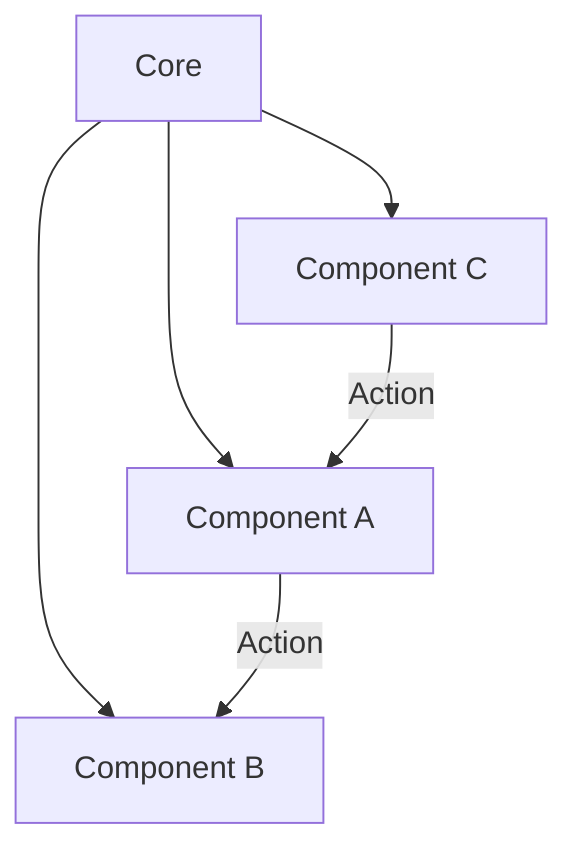

In this chapter, we will put aside writing code to learn about architecting a TUI application, and
the MVC architecture used in ratatui.

## Model-View-Controller

The MVC architecture is a design pattern that separates the application into three parts: the model,
the view, and the controller. It is commonly used in software development to separate the concerns
of the application into different components. In most architectures that you will come across while
using ratatui, the application will be split into a Model, a View and a Controller.

### Model

The model is the data that the application uses to make decisions. The model is essential for
keeping the data organized and consistent. It ensures that the application's data behaves according
to the defined rules and logic. In a ratatui application, the Model is the central `App` struct,
which hosts all application state and logic.

### View

The view is the part of the application that is responsible for displaying the data to the user. In
a ratatui application, the View is the `render` function, and the widgets that it has. They enable
the user to access and see the data stored within the Model.

### Controller

The controller is the part of the application that handles user input and updates the Model
accordingly. It is responsible for handling user interactions, such as keystrokes and mouse events.
In a ratatui application, the `Controller` is the function that handles key events.

## Architectural Patterns

In the (Rata)TUI world, there are a few architectural patterns that are commonly used. These
patterns help to organize the application and make it more maintainable. They also enable us to
build much more complicated and extensive TUI applications without pulling our whiskers out.

### The Elm Architecture

The Elm Architecture is a pattern that came about with the Elm programming language. It is very
similar to the MVC architecture. Each TEA (The Elm Architecture) application has:

1. `Model`, which is the state of the application;
2. `Update`, which is the function that handles user input and updates the Model;
3. `View`, which is the function that displays the Model to the user.

```svgbob
             +


      +
    /   \
  /       \           +------+                     +-------+                    +------------+
+    User   +         | View |                     | Model |                    | Controller |
  \       /           +------+                     +-------+                    +------------+
    \   /                |                             |                              |
      +                  |                             |                              |
      |                  |                             |                              |
      |                  |                             |                              |
      |---- user input ---------------------------------------------------------------------- controller receives event
      |                  |                             |                              |     |
      |                  |                             |                              |     |
      |                  |                             |                              |     |
      |                  |                             |                              |     |
      |                  | controller updates model ----------------------------------------+
      |                  |                             |                              |
      |                  |                             |                              |
      |                  |                             |                              |
      |                  -------------------------------- Model notifies View         |
      |                  |                             |                              |
      |                  |                             |                              |
      |-------------------- View updates               |                              |
      |                  |                             |                              |
      |                  |                             |                              |
      |                  |                             |                              |
      |                  |                             |                              |
      |                  |                             |                              |
      |                  |                             |                              |
      +                  |                             |                              |
    /   \                |                             |                              |
  /       \           +------+                     +-------+                    +------------+
+    User   +         | View |                     | Model |                    | Controller |
  \       /           +------+                     +-------+                    +------------+
    \   /
      +
```

When an event occurs, the Update receives it and updates the Model. The Model notifies the View,
which updates the screen. This is the essence of the Elm Architecture.

#### Ratatui Implementation

First, we need to create a `Model` struct that will hold the state of our application.

```rust
use ratatui::prelude::*;

pub struct Model {
    pub counter: i32,
    pub is_running: bool,
}
```

Now that we have a counter state, we need some way to update it. We can do this by creating the
`Update`, which are messages that the application uses to perform actions and update the model.

```rust
#[derive(PartialEq)]
pub enum Msg {
    Increment,
    Decrement,
    Reset,
    Quit,
}
```

To perform the actual update, we need an `update` function that takes the `Msg` and the `Model` as
arguments, and returns the updated `Model`. We may create this function in the `Model` struct, the
`Msg` enum or independently. In TEA, it’s crucial to maintain a clear separation between the data
(model) and the logic that alters it (update). This immutability principle ensures predictability
and makes the application easier to reason about. Therefore, it is best to create the function on
the `Msg` enum, however we can forgo this principle to suit our use case.

```rust
impl Msg {
    pub fn update(&self, model: &Model) {
        let mut model = model.clone();
        match self {
            Msg::Increment => model.counter += 1,
            Msg::Decrement => model.counter -= 1,
            Msg::Reset => model.counter = 0,
            Msg::Quit => model.is_running = false,
        }
        model
    }
}
```

This function will update the model based on the message. If we let go of the immutability
principle, we can pass an `&mut Model` to the function, allowing us to return another `Msg` from the
`update` function, letting us chain messages.

```rust
fn update(&self, model: &mut Model) -> Option<Msg> {
    match self {
        Msg::Increment => {
            model.counter += 1;
            if model.counter > 50 {
                return Some(Msg::Reset);
            }
        },
        Msg::Decrement => {
            model.counter -= 1;
            if model.counter < -50 {
                return Some(Msg::Reset);
            }
        },

        Msg::Reset => model.counter = 0,
        Msg::Quit => model.is_running = false,
    }
    None
}
```

Returning a `Msg` from the `update` function allows a developer to reason about their code as a
"Finite State Machine". Finite State Machines operate on defined states and transitions, where an
initial state and an event (in our case, a `Msg`) lead to a subsequent state. This cascading
approach ensures that the system remains in a consistent and predictable state after handling a
series of interconnected events.

Now that the Model is nice and updated, we need to update the View, to let the user see the changes.
The View is a function that takes the `Model` as an argument and paints the UI.

```rust
fn view(model: &Model, frame: &mut Frame) {
    frame.render_widget(
        Paragraph::new(format!("Counter: {}", model.counter)),
        frame.area(),
    );
}
```

In TEA, you are expected to ensure that your view function is side-effect free. The view() function
shouldn’t modify global state or perform any other actions. Its sole job is to map the model to a
visual representation.

For a given state of the model, the view function should always produce the same visual output. This
predictability makes your TUI application easier to reason about and debug.

However, `StatefulWidget` is a widget that requires mutable access to the model, in order to keep
track of the state of the widget. For this reason, you may choose to forego the view immutability
principle. For example, if you were interested in rendering a List, your view function may look like
this:

```rust
fn view(model: &mut Model, f: &mut Frame) {
    let items = model.items.items.iter().map(|element| ListItem::new(element)).collect();
    f.render_stateful_widget(List::new(items), f.area(), &mut model.items.state);
}

fn main() {
    loop {
        ...
        terminal.draw(|f| view(&mut model, f) )?;
        ...
    }
}
```

And that's it! We have successfully implemented the MVC architecture in our ratatui application.

### Component Architecture

If you are interested in a more object oriented approach to organizing TUIs, you can use a
`Component` based approach. It divides the logic of the application into smaller components, which
exhibit shared behaviour that allows the _core_ of the application to use them. This shared behviour
usually defines an interface to render the component, to pass events to it, and a way to communicate
between components and between the core and the components via some sort of message passing.



Each component has its own event handlers. This allows for a finer-grained approach to event
handling, with each component only dealing with the events it’s interested in. This contrasts with
Elm’s single update function that handles messages for the entire application.

If you're interested in the implementation of the component architecture, you can check out the
[component](https://github.com/ratatui/templates/tree/main/component) template.

### Flux Architecture

todo!()
