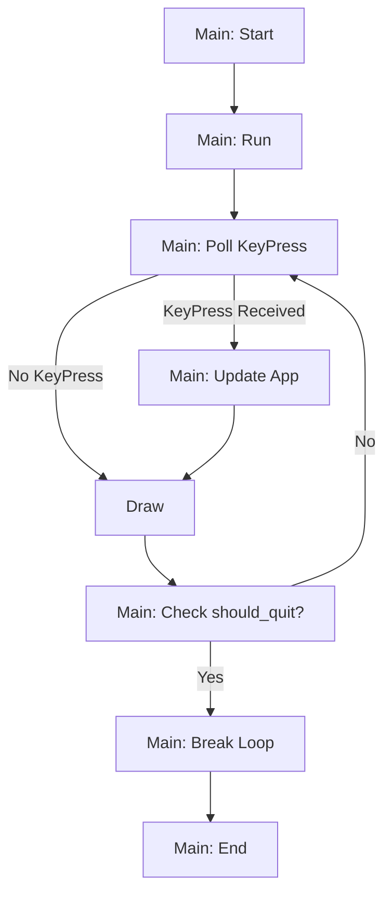

In this section, we will walk through the process of refactoring the application to set ourselves up
better for bigger projects. Not all of these changes are `ratatui` specific, and are generally good
coding practices to follow.

We are still going to keep everything in one file for this section, but we are going to split the
previous functionality into separate functions.

## Organizing imports

The first thing you might consider doing is reorganizing imports with qualified names.

```rust
use crossterm::{
  event::{self, Event::Key, KeyCode::Char},
  execute,
  terminal::{disable_raw_mode, enable_raw_mode, EnterAlternateScreen, LeaveAlternateScreen},
};
use ratatui::{
  prelude::{CrosstermBackend, Terminal, Frame},
  widgets::Paragraph,
};
```

## Typedefs and Type Aliases

By defining custom types and aliases, we can simplify our code and make it more expressive.

```rust
type Err = Box<dyn std::error::Error>;
type Result<T> = std::result::Result<T, Err>;
```

:::tip

If you use the popular [`anyhow`](https://docs.rs/anyhow/latest/anyhow/) then instead of these two
lines:

```rust
type Err = Box<dyn std::error::Error>;
type Result<T> = std::result::Result<T, Err>;
```

you can simply import `Result` from `anyhow`:

```rust
use color_eyre::eyre::Result;
```

You will need to run `cargo add anyhow` for this to work.

:::

## `App` struct

By defining an `App` struct, we can encapsulate our application state and make it more structured.

```rust
struct App {
  counter: i64,
  should_quit: bool,
}
```

- `counter` holds the current value of our counter.
- `should_quit` is a flag that indicates whether the application should exit its main loop.

## Breaking up `main()`

We can extract significant parts of the `main()` function into separate smaller functions, e.g.
`startup()`, `shutdown()`, `ui()`, `update()`, `run()`.

`startup()` is responsible for initializing the terminal.

```rust
fn startup() -> Result<()> {
  enable_raw_mode()?;
  execute!(std::io::stderr(), EnterAlternateScreen)?;
  Ok(())
}
```

`shutdown()` cleans up the terminal.

```rust
fn shutdown() -> Result<()> {
  execute!(std::io::stderr(), LeaveAlternateScreen)?;
  disable_raw_mode()?;
  Ok(())
}
```

`ui()` handles rendering of our application state.

```rust
fn ui(app: &App, f: &mut Frame) {
  f.render_widget(Paragraph::new(format!("Counter: {}", app.counter)), f.size());
}
```

`update()` processes user input and updates our application state.

```rust
fn update(app: &mut App) -> Result<()> {
  if event::poll(std::time::Duration::from_millis(250))? {
    if let Key(key) = event::read()? {
      if key.kind == event::KeyEventKind::Press {
        match key.code {
          Char('j') => app.counter += 1,
          Char('k') => app.counter -= 1,
          Char('q') => app.should_quit = true,
          _ => {},
        }
      }
    }
  }
  Ok(())
}
```

:::tip

You'll notice that in the `update()` function we make use of pattern matching for handling user
input. This is a powerful feature in rust; and enhances readability and provides a clear pattern for
how each input is processed.

You can learn more about
[pattern matching in the official rust book](https://doc.rust-lang.org/book/ch18-03-pattern-syntax.html).

:::

`run()` contains our main application loop.

```rust
fn run() -> Result<()> {
  // ratatui terminal
  let mut t = Terminal::new(CrosstermBackend::new(std::io::stderr()))?;

  // application state
  let mut app = App { counter: 0, should_quit: false };

  loop {
    // application update
    update(&mut app)?;

    // application render
    t.draw(|f| {
      ui(&app, f);
    })?;

    // application exit
    if app.should_quit {
      break;
    }
  }

  Ok(())
}
```

Each function now has a specific task, making our main application logic more organized and easier
to follow.

```rust
fn main() -> Result<()> {
  startup()?;
  let status = run();
  shutdown()?;
  status?;
  Ok(())
}
```

:::note

You may be wondering if we could have written the `main` function like so:

```rust
fn main() -> Result<()> {
  startup()?;
  run()?;
  shutdown()?;
  Ok(())
}
```

This works fine during the happy path of a program.

However, if your `run()` function returns an error, the program will not call `shutdown()`. And this
can leave your terminal in a messed up state for your users.

Instead, we should ensure that `shutdown()` is _always_ called before the program exits.

```rust
fn main() -> Result<()> {
  startup()?;
  let result = run();
  shutdown()?;
  result?;
  Ok(())
}
```

Here, we can get the result of `run()`, and call `shutdown()` first and then `unwrap()` on the
result. This will be a much better experience for users.

We will discuss in future sections how to handle the situation when your code unexpectedly panics.

:::

## Conclusion

By making our code more organized, modular, and readable, we not only make it easier for others to
understand and work with but also set the stage for future enhancements and extensions.

Here's the full code for reference:

```rust
use color_eyre::eyre::Result;
use crossterm::{
  event::{self, Event::Key, KeyCode::Char},
  execute,
  terminal::{disable_raw_mode, enable_raw_mode, EnterAlternateScreen, LeaveAlternateScreen},
};
use ratatui::{
  prelude::{CrosstermBackend, Terminal, Frame},
  widgets::Paragraph,
};


fn startup() -> Result<()> {
  enable_raw_mode()?;
  execute!(std::io::stderr(), EnterAlternateScreen)?;
  Ok(())
}

fn shutdown() -> Result<()> {
  execute!(std::io::stderr(), LeaveAlternateScreen)?;
  disable_raw_mode()?;
  Ok(())
}

// App state
struct App {
  counter: i64,
  should_quit: bool,
}

// App ui render function
fn ui(app: &App, f: &mut Frame) {
  f.render_widget(Paragraph::new(format!("Counter: {}", app.counter)), f.size());
}

// App update function
fn update(app: &mut App) -> Result<()> {
  if event::poll(std::time::Duration::from_millis(250))? {
    if let Key(key) = event::read()? {
      if key.kind == event::KeyEventKind::Press {
        match key.code {
          Char('j') => app.counter += 1,
          Char('k') => app.counter -= 1,
          Char('q') => app.should_quit = true,
          _ => {},
        }
      }
    }
  }
  Ok(())
}

fn run() -> Result<()> {
  // ratatui terminal
  let mut t = Terminal::new(CrosstermBackend::new(std::io::stderr()))?;

  // application state
  let mut app = App { counter: 0, should_quit: false };

  loop {
    // application update
    update(&mut app)?;

    // application render
    t.draw(|f| {
      ui(&app, f);
    })?;

    // application exit
    if app.should_quit {
      break;
    }
  }

  Ok(())
}

fn main() -> Result<()> {
  // setup terminal
  startup()?;

  let result = run();

  // teardown terminal before unwrapping Result of app run
  shutdown()?;

  result?;

  Ok(())
}
```

Here's a flow chart representation of the various steps in the program:



:::note[Homework]

What do you think happens if you modify the example above to change the polling to `0` milliseconds?

What would happen if you change the example to poll every 10 seconds?

Experiment with different "tick rates" and see how that affects the user experience. Monitor your
CPU usage when you do this experiment. What happens to your CPU usage as you change the poll
frequency?

:::
