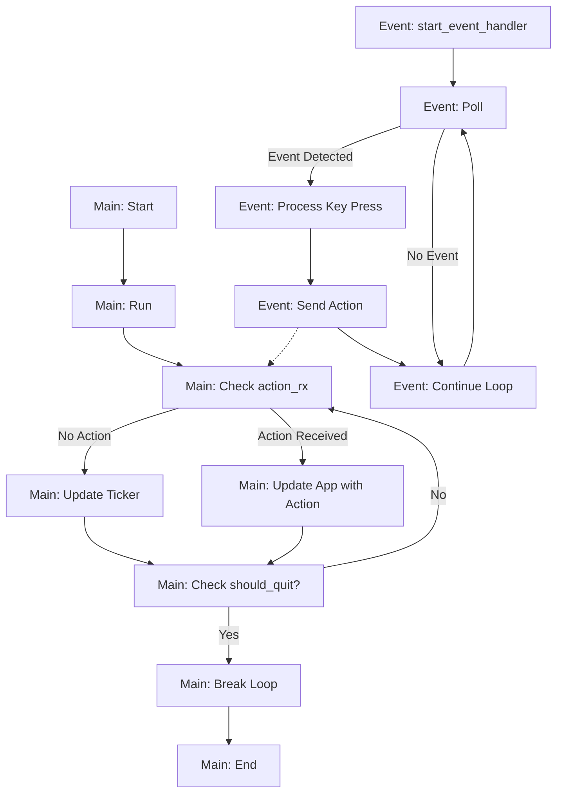

In order to set up an `async` application, it is important to make the generation of `Action`s
"asynchronous".

We can do this by spawning a tokio task like so:

```rust
fn start_event_handler(app: &App, tx: mpsc::UnboundedSender<Action>) -> tokio::task::JoinHandle<()> {
  let tick_rate = std::time::Duration::from_millis(250);
  tokio::spawn(async move {
    loop {
      let action = if crossterm::event::poll(tick_rate).unwrap() {
        if let crossterm::event::Event::Key(key) = crossterm::event::read().unwrap() {
          if key.kind == event::KeyEventKind::Press {
            match key.code {
              crossterm::event::KeyCode::Char('j') => Action::Increment,
              crossterm::event::KeyCode::Char('k') => Action::Decrement,
              crossterm::event::KeyCode::Char('q') => Action::Quit,
              _ => Action::None,
            }
          } else {
            Action::None
          }
        } else {
          Action::None
        }
      } else {
        Action::None
      };
      if let Err(_) = tx.send(action) {
        break;
      }
    }
  })
}
```

Here's the architecture of the application when using a separate `tokio` task to manage the
generation of `Action` events.



Here's the full code for your reference:

```rust
use std::time::Duration;

use color_eyre::eyre::Result;
use ratatui::{prelude::*, widgets::*};
use tokio::sync::mpsc;

pub fn initialize_panic_handler() {
  let original_hook = std::panic::take_hook();
  std::panic::set_hook(Box::new(move |panic_info| {
    shutdown().unwrap();
    original_hook(panic_info);
  }));
}

fn startup() -> Result<()> {
  crossterm::terminal::enable_raw_mode()?;
  crossterm::execute!(std::io::stderr(), crossterm::terminal::EnterAlternateScreen)?;
  Ok(())
}

fn shutdown() -> Result<()> {
  crossterm::execute!(std::io::stderr(), crossterm::terminal::LeaveAlternateScreen)?;
  crossterm::terminal::disable_raw_mode()?;
  Ok(())
}

struct App {
  action_tx: mpsc::UnboundedSender<Action>,
  counter: i64,
  should_quit: bool,
  ticker: i64,
}

fn ui(f: &mut Frame, app: &mut App) {
  let area = f.size();
  f.render_widget(
    Paragraph::new(format!(
      "Press j or k to increment or decrement.\n\nCounter: {}\n\nTicker: {}",
      app.counter, app.ticker
    ))
    .block(
      Block::default()
        .title("ratatui async counter app")
        .title_alignment(Alignment::Center)
        .borders(Borders::ALL)
        .border_type(BorderType::Rounded),
    )
    .style(Style::default().fg(Color::Cyan))
    .alignment(Alignment::Center),
    area,
  );
}

#[derive(PartialEq)]
enum Action {
  Increment,
  Decrement,
  Quit,
  None,
}

fn update(app: &mut App, msg: Action) -> Action {
  match msg {
    Action::Increment => {
      app.counter += 1;
    },
    Action::Decrement => {
      app.counter -= 1;
    },
    Action::Quit => app.should_quit = true, // You can handle cleanup and exit here
    _ => {},
  };
  Action::None
}

fn start_event_handler(app: &App, tx: mpsc::UnboundedSender<Action>) -> tokio::task::JoinHandle<()> {
  let tick_rate = std::time::Duration::from_millis(250);
  tokio::spawn(async move {
    loop {
      let action = if crossterm::event::poll(tick_rate).unwrap() {
        if let crossterm::event::Event::Key(key) = crossterm::event::read().unwrap() {
          if key.kind == event::KeyEventKind::Press {
            match key.code {
              crossterm::event::KeyCode::Char('j') => Action::Increment,
              crossterm::event::KeyCode::Char('k') => Action::Decrement,
              crossterm::event::KeyCode::Char('q') => Action::Quit,
              _ => Action::None,
            }
          } else {
            Action::None
          }
        } else {
          Action::None
        }
      } else {
        Action::None
      };
      if let Err(_) = tx.send(action) {
        break;
      }
    }
  })
}

async fn run() -> Result<()> {
  let mut t = Terminal::new(CrosstermBackend::new(std::io::stderr()))?;

  let (action_tx, mut action_rx) = mpsc::unbounded_channel();

  let mut app = App { counter: 0, should_quit: false, action_tx, ticker: 0 };

  let task = start_event_handler(&app, app.action_tx.clone());

  loop {
    t.draw(|f| {
      ui(f, &mut app);
    })?;

    if let Some(action) = action_rx.recv().await {
      update(&mut app, action);
    }

    if app.should_quit {
      break;
    }
    app.ticker += 1;
  }

  task.abort();

  Ok(())
}

#[tokio::main]
async fn main() -> Result<()> {
  initialize_panic_handler();
  startup()?;
  run().await?;
  shutdown()?;
  Ok(())
}
```
