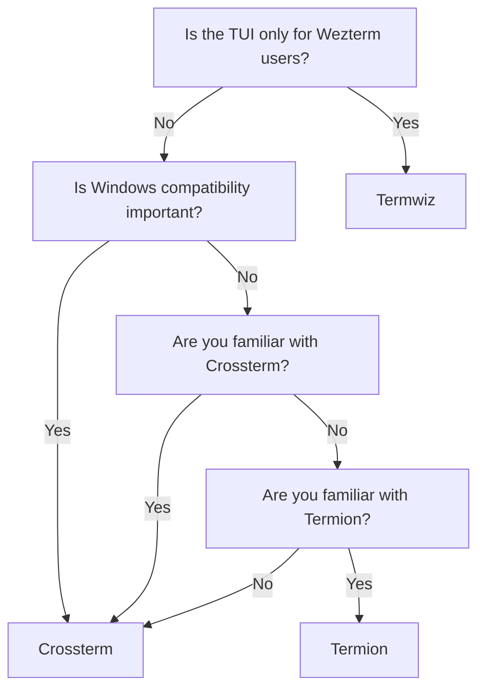

# How to Choose a Backend

```admonish tldr
Choose [Crossterm](https://crates.io/crates/crossterm) for most tasks.
```

Ratatui interfaces with the terminal emulator through its "backends". These are powerful libraries
that grant `ratatui` the ability to capture keypresses, maneuver the cursor, style the text with
colors and other features. As of now, `ratatui` supports three backends:

- [Crossterm](https://github.com/crossterm-rs/crossterm)
- [Termion](https://github.com/redox-os/termion)
- [Termwiz](https://github.com/wez/wezterm/tree/main/termwiz)

Selecting a backend does influence your project's structure, but the core functionalities remain
consistent across all options. Here's a flowchart that can help you make your decision.



Though we try to make sure that all backends are fully-supported, the most commonly-used backend is
Crossterm. If you have no particular reason to use Termion or Termwiz, you will find it easiest to
learn Crossterm simply due to its popularity.
