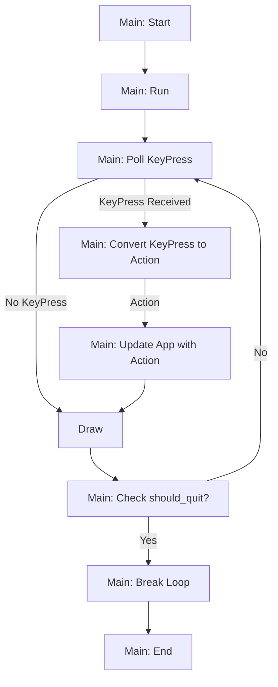

# Counter App with Actions

Let's take the single file multiple function example from the counter app from earlier:

```rust
// Hover on this codeblock and click "Show hidden lines" to see the code
// --snip--
# use anyhow::Result;
# use crossterm::{
#   event::{self, Event::Key, KeyCode::Char},
#   execute,
#   terminal::{disable_raw_mode, enable_raw_mode, EnterAlternateScreen, LeaveAlternateScreen},
# };
# use ratatui::{
#   prelude::{CrosstermBackend, Terminal},
#   widgets::Paragraph,
# };
#
# pub type Frame<'a> = ratatui::Frame<'a, CrosstermBackend<std::io::Stderr>>;
#
# fn startup() -> Result<()> {
#   enable_raw_mode()?;
#   execute!(std::io::stderr(), EnterAlternateScreen)?;
#   Ok(())
# }
#
# fn shutdown() -> Result<()> {
#   execute!(std::io::stderr(), LeaveAlternateScreen)?;
#   disable_raw_mode()?;
#   Ok(())
# }
#
# // App state
# struct App {
#   counter: i64,
#   should_quit: bool,
# }
#
# // App ui render function
# fn ui(app: &App, f: &mut Frame<'_>) {
#   f.render_widget(Paragraph::new(format!("Counter: {}", app.counter)), f.size());
# }
#
# // App update function
# fn update(app: &mut App) -> Result<()> {
#   if event::poll(std::time::Duration::from_millis(250))? {
#     if let Key(key) = event::read()? {
#       if key.kind == event::KeyEventKind::Press {
#         match key.code {
#           Char('j') => app.counter += 1,
#           Char('k') => app.counter -= 1,
#           Char('q') => app.should_quit = true,
#           _ => (),
#         }
#       }
#     }
#   }
#   Ok(())
# }
#
# fn run() -> Result<()> {
#   // ratatui terminal
#   let mut t = Terminal::new(CrosstermBackend::new(std::io::stderr()))?;
#
#   // application state
#   let mut app = App { counter: 0, should_quit: false };
#
#   loop {
#     // application update
#     update(&mut app)?;
#
#     // application render
#     t.draw(|f| {
#       ui(&app, f);
#     })?;
#
#     // application exit
#     if app.should_quit {
#       break;
#     }
#   }
#
#   Ok(())
# }
#
# fn main() -> Result<()> {
#   // setup terminal
#   startup()?;
#
#   let result = run();
#
#   // teardown terminal before unwrapping Result of app run
#   shutdown()?;
#
#   result?;
#
#   Ok(())
# }
```

One of the first steps to building a `async` applications is to use the `Command`, `Action`, or
`Message` pattern.

```admonish tip
The `Command` pattern is the concept of "reified method calls".
You can learn a lot more about this pattern from the excellent [http://gameprogrammingpatterns.com](http://gameprogrammingpatterns.com/command.html).
```

You can learn more about this concept in
[The Elm Architecture section](../../concepts/application-patterns/the-elm-architecture.md) of the
documentation.

We have learnt about enums JSON-editor tutorial. We are going to extend the counter application to
include "Action"s using Rust's enum features. The key idea is that we have an `Action` enum that
tracks all the actions that can be carried out by the `App`. Here's the variants of the `Action`
enum we will be using:

```rust
pub enum Action {
  Tick,
  Increment,
  Decrement,
  Quit,
  None,
}
```

Now we add a new `get_action` function to map a `KeyEvent` to an `Action`.

```rust
fn get_action(_app: &App) -> Action {
  let tick_rate = std::time::Duration::from_millis(250);
  if event::poll(tick_rate).unwrap() {
    if let Key(key) = event::read().unwrap() {
      if key.kind == event::KeyEventKind::Press {
        return match key.code {
          Char('j') => Action::Increment,
          Char('k') => Action::Decrement,
          Char('q') => Action::Quit,
          _ => Action::None,
        };
      }
    }
  };
  Action::None
}
```

````admonish tip
Instead of using a `None` variant in `Action`, you can drop the `None` from `Action`
and use Rust's built-in `Option` types instead.
This is what your code might actually look like:

```rust
fn get_action(_app: &App) -> Result<Option<Action>> {
  let tick_rate = std::time::Duration::from_millis(250);
  if event::poll(tick_rate)? {
    if let Key(key) = event::read()? {
      if key.kind == event::KeyEventKind::Press {
        let action = match key.code {
          Char('j') => Action::Increment,
          Char('k') => Action::Decrement,
          Char('q') => Action::Quit,
          _ => return Ok(None),
        };
        return Ok(Some(action))
      }
    }
  };
  Ok(None)
}
```

But, for illustration purposes, in this tutorial we will stick to using `Action::None` for now.
````

And the `update` function takes an `Action` instead:

```rust
fn update(app: &mut App, action: Action) {
  match action {
    Action::Quit => app.should_quit = true,
    Action::Increment => app.counter += 1,
    Action::Decrement => app.counter -= 1,
    Action::Tick => {},
    _ => {},
  };
}

```

Here's the full single file version of the counter app using the `Action` enum for your reference:

```rust
use anyhow::Result;
use crossterm::{
  event::{self, Event::Key, KeyCode::Char},
  execute,
  terminal::{disable_raw_mode, enable_raw_mode, EnterAlternateScreen, LeaveAlternateScreen},
};
use ratatui::{
  prelude::{CrosstermBackend, Terminal},
  widgets::Paragraph,
};

pub type Frame<'a> = ratatui::Frame<'a, CrosstermBackend<std::io::Stderr>>;

fn startup() -> Result<()> {
  enable_raw_mode()?;
  execute!(std::io::stderr(), EnterAlternateScreen)?;
  Ok(())
}

fn shutdown() -> Result<()> {
  execute!(std::io::stderr(), LeaveAlternateScreen)?;
  disable_raw_mode()?;
  Ok(())
}

// App state
struct App {
  counter: i64,
  should_quit: bool,
}

// App actions
pub enum Action {
  Tick,
  Increment,
  Decrement,
  Quit,
  None,
}

// App ui render function
fn ui(app: &App, f: &mut Frame<'_>) {
  f.render_widget(Paragraph::new(format!("Counter: {}", app.counter)), f.size());
}

fn get_action(_app: &App) -> Action {
  let tick_rate = std::time::Duration::from_millis(250);
  if event::poll(tick_rate).unwrap() {
    if let Key(key) = event::read().unwrap() {
      if key.kind == event::KeyEventKind::Press {
        return match key.code {
          Char('j') => Action::Increment,
          Char('k') => Action::Decrement,
          Char('q') => Action::Quit,
          _ => Action::None,
        };
      }
    }
  };
  Action::None
}

fn update(app: &mut App, action: Action) {
  match action {
    Action::Quit => app.should_quit = true,
    Action::Increment => app.counter += 1,
    Action::Decrement => app.counter -= 1,
    Action::Tick => {},
    _ => {},
  };
}

fn run() -> Result<()> {
  // ratatui terminal
  let mut t = Terminal::new(CrosstermBackend::new(std::io::stderr()))?;

  // application state
  let mut app = App { counter: 0, should_quit: false };

  loop {
    let action = get_action(&mut app);

    // application update
    update(&mut app, action);

    // application render
    t.draw(|f| {
      ui(&app, f);
    })?;

    // application exit
    if app.should_quit {
      break;
    }
  }

  Ok(())
}

fn main() -> Result<()> {
  // setup terminal
  startup()?;

  let result = run();

  // teardown terminal before unwrapping Result of app run
  shutdown()?;

  result?;

  Ok(())
}
```



While this may seem like a lot more boilerplate to achieve the same thing, `Action` enums have a few
advantages.

Firstly, they can be mapped from keypresses programmatically. For example, you can define a
configuration file that reads which keys are mapped to which `Action` like so:

```toml
[keymap]
"q" = "Quit"
"j" = "Increment"
"k" = "Decrement"
```

Then you can add a new key configuration like so:

```rust
struct App {
  counter: i64,
  should_quit: bool,
  // new field
  keyconfig: HashMap<KeyCode, Action>
}
```

If you populate `keyconfig` with the contents of a user provided `toml` file, then you can figure
out which action to take by updating the `get_action()` function:

```rust
fn get_action(app: &App) -> Action {
  let tick_rate = std::time::Duration::from_millis(250);
  if event::poll(tick_rate).unwrap() {
    if let Key(key) = event::read().unwrap() {
      if key.kind == event::KeyEventKind::Press {
        return app.keyconfig.get(key.code).unwrap_or(Action::None)
      }
    }
  };
  Action::None
}
```

Another advantage of this is that the business logic of the `App` struct can be tested without
having to create an instance of a `Tui` or `EventHandler`, e.g.:

```rust
mod tests {
  #[test]
  fn test_app() {
    let mut app = App::new();
    let old_counter = app.counter;
    update(&mut app, Action::Increment);
    assert!(app.counter == old_counter + 1);
  }
}
```

In the test above, we did not create an instance of the `Terminal` or the `EventHandler`, and did
not call the `run` function, but we are still able to test the business logic of our application.
Updating the app state on `Action`s gets us one step closer to making our application a "state
machine", which improves understanding and testability.

If we wanted to be purist about it, we would make a struct called `AppState` which would be
immutable, and we would have an `update` function return a new instance of the `AppState`:

```rust
fn update(app_state: AppState, action: Action) -> AppState {
  let mut state = app_state.clone();
  state.counter += 1;
  state
}
```

````admonish note
[`Charm`'s `bubbletea`](https://github.com/charmbracelet/bubbletea) also follows the TEA paradigm.
Here's an example of what the `Update` function for a counter example might look like in Go:

```go
func (m model) Update(msg tea.Msg) (tea.Model, tea.Cmd) {
    switch msg := msg.(type) {

    // Is it a key press?
    case tea.KeyMsg:
        // These keys should exit the program.
        case "q":
            return m, tea.Quit

        case "k":
            m.counter--

        case "j":
            m.counter++
    }

    // Note that we're not returning a command.
    return m, nil
}
```

````

Like in `Charm`, we may also want to choose a action to follow up after an `update` by returning
another `Action`:

```rust
fn update(app_state: AppState, action: Action) -> (AppState, Action) {
  let mut state = app_state.clone();
  state.counter += 1;
  (state, Action::None) // no follow up action
  // OR
  (state, Action::Tick) // force app to tick
}
```

We would have to modify our `run` function to handle the above paradigm though. Also, writing code
to follow this architecture in Rust requires more upfront design, mostly because you have to make
your `AppState` struct `Clone`-friendly.

For this tutorial, we will stick to having a mutable `App`:

```rust
fn update(app: &mut App, action: Action) {
  match action {
    Action::Quit => app.should_quit = true,
    Action::Increment => app.counter += 1,
    Action::Decrement => app.counter -= 1,
    Action::Tick => {},
    _ => {},
  };
}
```

The other advantage of using an `Action` enum is that you can tell your application what it should
do next by sending a message over a channel. We will discuss this approach in the next section.
