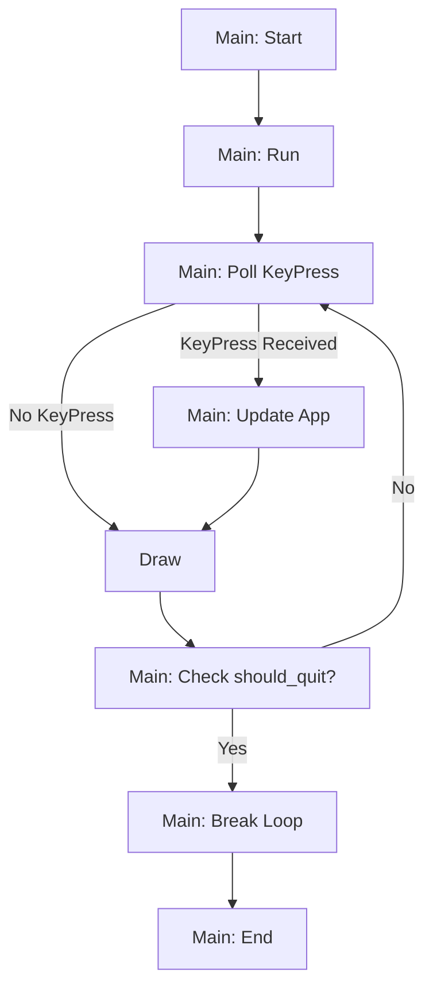
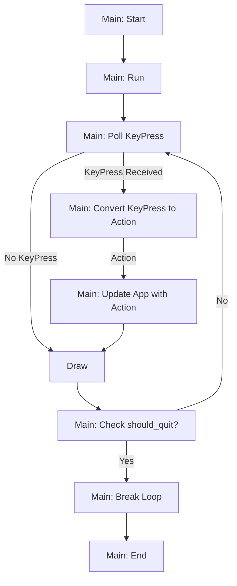

# Counter App with Actions

Let's take the single file multiple function example from the counter app from earlier.

This was what the flow chart looked like.



Now that we know what enums are, we are going to extend the counter application to include
"Action"s. One of the first steps to building a `async` applications is to use the `Command`,
`Action`, or `Message` pattern.

```admonish tip
The `Command` pattern is the concept of "reified method calls".
You can learn a lot more about this pattern from the excellent [http://gameprogrammingpatterns.com](http://gameprogrammingpatterns.com/command.html).
```

You can learn more about this concept in
[The Elm Architecture section](../../concepts/application-patterns/the-elm-architecture.md) of the
documentation.

The key idea is that we have an `Action` enum that tracks all the actions that can be carried out by
the `App`. Here's the variants of the `Action` enum we will be using:

```rust
pub enum Action {
  Tick,
  Increment,
  Decrement,
  Quit,
  None,
}
```

Now we add a new `get_action` function to map a `KeyEvent` to an `Action`.

```rust
fn get_action(_app: &App) -> Action {
  let tick_rate = std::time::Duration::from_millis(250);
  if event::poll(tick_rate).unwrap() {
    if let Key(key) = event::read().unwrap() {
      if key.kind == event::KeyEventKind::Press {
        return match key.code {
          Char('j') => Action::Increment,
          Char('k') => Action::Decrement,
          Char('q') => Action::Quit,
          _ => Action::None,
        };
      }
    }
  };
  Action::None
}
```

````admonish tip
Instead of using a `None` variant in `Action`, you can drop the `None` from `Action`
and use Rust's built-in `Option` types instead.
This is what your code might actually look like:

```rust
fn get_action(_app: &App) -> Result<Option<Action>> {
  let tick_rate = std::time::Duration::from_millis(250);
  if event::poll(tick_rate)? {
    if let Key(key) = event::read()? {
      if key.kind == event::KeyEventKind::Press {
        let action = match key.code {
          Char('j') => Action::Increment,
          Char('k') => Action::Decrement,
          Char('q') => Action::Quit,
          _ => return Ok(None),
        };
        return Ok(Some(action))
      }
    }
  };
  Ok(None)
}
```

But, for illustration purposes, in this tutorial we will stick to using `Action::None` for now.
````

And the `update` function takes an `Action` instead, unlike before where it took a `KeyEvent`.

```rust
fn update(app: &mut App, action: Action) {
  match action {
    Action::Quit => app.should_quit = true,
    Action::Increment => app.counter += 1,
    Action::Decrement => app.counter -= 1,
    Action::Tick => {},
    _ => {},
  };
}

```

Here's the full single file version of the counter app using the `Action` enum for your reference:

```rust
use anyhow::Result;
use crossterm::{
  event::{self, Event::Key, KeyCode::Char},
  execute,
  terminal::{disable_raw_mode, enable_raw_mode, EnterAlternateScreen, LeaveAlternateScreen},
};
use ratatui::{
  prelude::{CrosstermBackend, Terminal},
  widgets::Paragraph,
};

pub type Frame<'a> = ratatui::Frame<'a, CrosstermBackend<std::io::Stderr>>;

fn startup() -> Result<()> {
  enable_raw_mode()?;
  execute!(std::io::stderr(), EnterAlternateScreen)?;
  Ok(())
}

fn shutdown() -> Result<()> {
  execute!(std::io::stderr(), LeaveAlternateScreen)?;
  disable_raw_mode()?;
  Ok(())
}

// App state
struct App {
  counter: i64,
  should_quit: bool,
}

// App actions
pub enum Action {
  Tick,
  Increment,
  Decrement,
  Quit,
  None,
}

// App ui render function
fn ui(f: &mut Frame<'_>, app: &App) {
  f.render_widget(Paragraph::new(format!("Counter: {}", app.counter)), f.size());
}

fn get_action(_app: &App) -> Action {
  let tick_rate = std::time::Duration::from_millis(250);
  if event::poll(tick_rate).unwrap() {
    if let Key(key) = event::read().unwrap() {
      if key.kind == event::KeyEventKind::Press {
        return match key.code {
          Char('j') => Action::Increment,
          Char('k') => Action::Decrement,
          Char('q') => Action::Quit,
          _ => Action::None,
        };
      }
    }
  };
  Action::None
}

fn update(app: &mut App, action: Action) {
  match action {
    Action::Quit => app.should_quit = true,
    Action::Increment => app.counter += 1,
    Action::Decrement => app.counter -= 1,
    Action::Tick => {},
    _ => {},
  };
}

fn run() -> Result<()> {
  // ratatui terminal
  let mut t = Terminal::new(CrosstermBackend::new(std::io::stderr()))?;

  // application state
  let mut app = App { counter: 0, should_quit: false };

  loop {
    let action = get_action(&mut app);

    // application update
    update(&mut app, action);

    // application render
    t.draw(|f| {
      ui(f, &app);
    })?;

    // application exit
    if app.should_quit {
      break;
    }
  }

  Ok(())
}

fn main() -> Result<()> {
  // setup terminal
  startup()?;

  let result = run();

  // teardown terminal before unwrapping Result of app run
  shutdown()?;

  result?;

  Ok(())
}
```



This may seem like a lot more boilerplate to achieve the same thing. However, `Action` enums have a
few advantages.

Firstly, they can be mapped from keypresses programmatically. For example, you can define a
configuration file that reads which keys are mapped to which `Action` like so:

```toml
[keymap]
"q" = "Quit"
"j" = "Increment"
"k" = "Decrement"
```

Then you can add a new key configuration like so:

```rust
struct App {
  counter: i64,
  should_quit: bool,
  // new field
  keyconfig: HashMap<KeyCode, Action>
}
```

If you populate `keyconfig` with the contents of a user provided `toml` file, then you can figure
out which action to take by updating the `get_action()` function:

```rust
fn get_action(app: &App) -> Action {
  let tick_rate = std::time::Duration::from_millis(250);
  if event::poll(tick_rate).unwrap() {
    if let Key(key) = event::read().unwrap() {
      if key.kind == event::KeyEventKind::Press {
        return app.keyconfig.get(key.code).unwrap_or(Action::None)
      }
    }
  };
  Action::None
}
```

The other advantage of using an `Action` enum is that you can tell your application what it should
do next by sending a message over a channel. We will discuss this approach in the next section.
